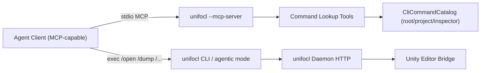

# unifocl Built-in MCP Server Architecture

This document explains how `unifocl --mcp-server` is structured, what it is for, and how to connect agent clients by editing their JSON config files.

## Purpose

The built-in MCP server is designed to reduce prompt/token overhead for automation agents by exposing compact command lookup tools instead of requiring agents to read `README.md` or run broad `/help` exploration first.

- Transport: stdio
- Server process: `unifocl --mcp-server`
- SDK: .NET MCP C# SDK (`ModelContextProtocol` + `Microsoft.Extensions.Hosting`)
- Mutation business logic: remains in unifocl daemon HTTP endpoints (not moved into MCP tools)

## Runtime Architecture



Architecture boundary:

1. MCP server scope:
   - command discovery and lookup (`ListCommands`, `LookupCommand`)
   - low-token context hydration for agents
2. Daemon scope:
   - project/hierarchy/inspector/build mutation execution
   - durable mutation lifecycle (`submit -> status -> result`)

## MCP Tools

Current tools exposed by the server:

1. `ListCommands(scope, query, limit)`
   - returns command list from `CliCommandCatalog`
   - use for discovery and filtered browsing
2. `LookupCommand(command, scope)`
   - returns best command matches with signature and description
   - use for exact/near-exact lookup before execution planning

Scopes:

- `root`
- `project`
- `inspector`
- `all` (default)

## Agent JSON Config

Most MCP-capable clients use a JSON object where each MCP server entry defines:

- executable `command`
- launch `args`
- optional `cwd`
- optional `env`

Use this baseline:

```json
{
  "mcpServers": {
    "unifocl": {
      "command": "unifocl",
      "args": ["--mcp-server"],
      "cwd": "/absolute/path/to/your/workspace",
      "env": {
        "UNIFOCL_CONFIG_ROOT": "/absolute/path/to/your/workspace/.local/unifocl-config"
      }
    }
  }
}
```

If `unifocl` is not on PATH, use an absolute binary path:

```json
{
  "mcpServers": {
    "unifocl": {
      "command": "/absolute/path/to/unifocl",
      "args": ["--mcp-server"]
    }
  }
}
```

## Automation Script

To speed up setup across multiple agent clients, use:

`scripts/setup-mcp-agents.sh`

Examples:

```bash
# 1) Configure Codex only
scripts/setup-mcp-agents.sh --workspace . --codex

# 2) Configure Cursor + Claude Code JSON configs in one run
scripts/setup-mcp-agents.sh \
  --workspace . \
  --cursor-config ~/.cursor/mcp.json \
  --claude-config ~/.claude/mcp.json

# 3) Preview changes without writing
scripts/setup-mcp-agents.sh --workspace . --codex --cursor-config ~/.cursor/mcp.json --dry-run
```

Script behavior:

1. Creates workspace-local `UNIFOCL_CONFIG_ROOT` (default: `<workspace>/.local/unifocl-config`).
2. Registers or updates `mcpServers.unifocl` idempotently.
3. Uses `unifocl --mcp-server` if `unifocl` is on PATH; otherwise falls back to:
   - `dotnet run --project <workspace>/src/unifocl/unifocl.csproj -- --mcp-server`
4. For JSON targets, writes a `.bak` backup before updating.

## Per-Agent Notes

Different agent apps store config in different JSON files and may add extra fields (for example, per-server enable flags, startup timeouts, or tool allowlists). The critical part is always the same:

1. register an MCP server named `unifocl`
2. run `unifocl --mcp-server` over stdio
3. keep `cwd` and `env` aligned with the workspace where the agent executes commands

## Verification

After updating agent config:

1. Restart the agent app/session.
2. Confirm tools include `ListCommands` and `LookupCommand`.
3. Run:
   - `LookupCommand("/open", "root")`
   - `ListCommands("project", "build", 20)`

If tools do not appear, re-check:

1. `command` path is valid
2. `args` includes `--mcp-server`
3. client actually supports stdio MCP servers
