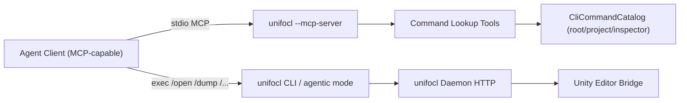

# unifocl


**The programmable operations layer for Unity—built for keyboard-driven developers and autonomous AI agents.**

Unity is a powerful engine, but its graphical, mouse-driven Editor can introduce friction for automation, LLM workflows, and developers who prefer the terminal. unifocl solves this by providing a structured, deterministic way to interact with, navigate, and mutate your Unity projects without relying on the GUI.

Whether you are a developer looking for a snappy Terminal User Interface (TUI) to manipulate scenes, or you are hooking up an AI agent via the Model Context Protocol (MCP) to autonomously write code and edit prefabs, unifocl provides the bridge.

unifocl is an independent project and is not associated with, affiliated with, or endorsed by Unity Technologies.

## Why unifocl?

- **Native Agentic Tooling (MCP):** Comes with a built-in MCP server. AI agents (like Claude) can seamlessly read your hierarchy, inspect components, and safely mutate assets using strict JSON/YAML response envelopes.
- **Lean & Token-Efficient:** LLMs struggle with massive, unstructured context windows. unifocl is specifically designed to keep its API surface streamlined, feeding agents exactly the project state they need. This saves tokens, reduces costs, and keeps your agents focused.
- **Safe, Deterministic Mutations:** Never let an AI break your project. Every single mutation command features mandatory dry-run capabilities and transactional safety (Undo/Redo integration), ensuring predictability before anything touches the disk.
- **Instantly Extensible:** Need a custom tool for your agent? Add the `[UnifoclCommand]` attribute to your C# editor methods. unifocl automatically discovers them and exposes them as live MCP tools with built-in dry-run sandboxing.
- **Dual-Interface:** A clean, keyboard-driven Spectre.Console TUI for humans, alongside a stateless, headless execution path for multi-agent workflows.
- **Debug Artifact Reports:** Collect tiered snapshots of your project state—console logs, validation results, profiler data, recorder output—into a single structured JSON file. Feed it to agents for automated bug reports or pipe it straight to Jira/Wrike.
- **Zero-Touch Compilation:** Deploy new editor scripts and let unifocl trigger Unity recompilation automatically—no manual window focusing required.
- **Runtime Operations:** Control running player instances—Editor PlayMode, standalone builds, mobile devices—through the same typed, risk-classified interface. Attach to targets, execute queries, and extend the surface with your own `[UnifoclRuntimeCommand]` methods packaged into lazy-loadable categories.

## Installation

### macOS (Apple Silicon & Intel)

**Shell Installer:**

```sh
curl -fsSL https://raw.githubusercontent.com/Kiankinakomochi/unifocl/main/scripts/install.sh | sh
```

**Homebrew:**

```sh
brew tap Kiankinakomochi/unifocl
brew install unifocl
```

### Windows (x64)

**Winget:**

```
winget install unifocl
```

**PowerShell Installer:**

```powershell
iwr -useb https://raw.githubusercontent.com/Kiankinakomochi/unifocl/main/scripts/install.ps1 | iex
```

### Manual Download

Download pre-built archives from the [latest GitHub release](https://github.com/Kiankinakomochi/unifocl/releases/latest) and place the binary anywhere in your `PATH`.

### Agent Setup (Claude Code & Codex)

```sh
unifocl agent setup /path/to/your-unity-project
```

Auto-detects installed agent tools (`claude`, `codex`) and writes the required config files into the project directory. Commit the generated `.claude/settings.json` and `CLAUDE.md` to share the integration with your team — each contributor runs `agent setup` once locally for their own permissions.

## Requirements

- **.NET 10** (or later) for the CLI.
- **Unity 2020.1 or later** for editor scripts. Unity 2022.1+ is recommended — newer APIs (e.g. `FindObjectsByType`) are used when available, with automatic fallbacks for older versions. The Roslyn analyzer integration requires Unity 2022.2+.

## Quick Start

### For Humans (The TUI)

Launch the interactive shell to navigate your project at the speed of thought.

```sh
# Start the unifocl bridge in your project
unifocl

> /open ./MyUnityProject
> /hierarchy
> f PlayerController        # Fuzzy find
> mk Cube                   # Create a GameObject
> /inspect 12               # Inspect the object
> set speed 5               # Change a component field
```

### For AI (The MCP Server & Agentic Execution)

Agents can use the built-in MCP server or the one-shot `exec` path to read deterministic state and make safe changes.

```sh
# Run an agentic dry-run to see what will change
unifocl exec "rename 3 PlayerController --dry-run" --agentic --format json
```

unifocl returns a structured diff payload, letting the LLM verify the change before committing it:

```json
{
  "status": "success",
  "action": "rename",
  "diff": {
    "format": "unified",
    "summary": "Rename GameObject index 3",
    "lines": ["--- before", "+++ after", "-  name: \"Cube\"", "+  name: \"PlayerController\""]
  }
}
```

Every mutation command supports `--dry-run`. The operation executes inside a Unity Undo group, captures a before/after diff, and immediately reverts—nothing touches the disk until you confirm.

### Custom MCP Tools with `[UnifoclCommand]`

Expose your own C# editor methods as live MCP tools:

```csharp
[UnifoclCommand("myteam.reset-player", "Reset player to spawn point")]
public static void ResetPlayer(UnifoclCommandContext ctx)
{
    var player = GameObject.FindWithTag("Player");
    player.transform.position = Vector3.zero;
    ctx.Return("Player reset to origin");
}
```

unifocl discovers these at runtime and makes them available as MCP tools—complete with automatic dry-run sandboxing. See [`docs/custom-commands.md`](docs/custom-commands.md) for the full guide.

### Dynamic C# Eval

Execute arbitrary C# directly in the Unity Editor context—no script files needed:

```sh
# Simple read query
unifocl eval 'return Application.productName;'

# Dry-run: execute and revert all Unity Undo-tracked changes
unifocl eval 'Undo.RecordObject(Camera.main, "t"); Camera.main.name = "CHANGED";' --dry-run
```

Eval uses a dual-compiler strategy (Unity `AssemblyBuilder` in Bridge mode, bundled Roslyn in Host mode) and supports `async`/`await`, custom declarations, timeout protection, and `--dry-run` sandboxing. The entry point is always `async Task<object>`, so `await` works naturally.

### Asset Describe — Let Agents See Without Vision Tokens

AI agents working with Unity often need to understand what an asset *looks like* — is this sprite a character? A tileset? A UI icon? Normally this means sending the image to a multimodal LLM and burning tokens on cross-modal comprehension.

`asset.describe` solves this by running a local vision model (BLIP or CLIP) on your machine. Unity exports a thumbnail, the CLI captions it locally, and the agent receives a compact text description — zero vision tokens spent.

```sh
unifocl exec '{"operation":"asset.describe","args":{"assetPath":"Assets/Sprites/hero.png"},"requestId":"r1"}'
```

```json
{
  "status": "Completed",
  "result": {
    "description": "a cartoon character with a blue hat",
    "assetType": "Texture2D",
    "engine": "blip",
    "model": "Salesforce/blip-image-captioning-base@82a37760"
  }
}
```

Choose between two engines:
- **`blip`** (default) — open-ended natural language captions
- **`clip`** — zero-shot classification against game-asset labels (sprite, mesh, UI, material, etc.)

**Dependencies:** Requires `python3` (>= 3.10) and [`uv`](https://docs.astral.sh/uv/) — run `unifocl init` to install them automatically. Runtime installs are driven by a hash-locked requirements file (`uv run --with-requirements`) pinned to [`transformers==5.5.0`](https://pypi.org/project/transformers/5.5.0/), [`torch==2.11.0`](https://pypi.org/project/torch/2.11.0/) (CPU-compatible wheel selection by platform), and [`Pillow==12.2.0`](https://pypi.org/project/Pillow/12.2.0/). The first invocation also downloads the model weights (~990 MB for BLIP, ~600 MB for CLIP) from HuggingFace; subsequent runs load entirely from cache with no network access. Model revisions are pinned to exact commit SHAs for supply-chain safety.

See the [Command Reference — Asset Describe](docs/command-reference.md#6-asset-describe-local-vision) for full details.

## Documentation Reference

To keep this README clean, detailed technical specifications and command lists have been split into dedicated documents:

| Document | Description |
| --- | --- |
| [Command & TUI Reference](docs/command-reference.md) | Full list of slash commands, contextual operations, keyboard shortcuts, dry-run mechanics, and eval details. |
| [Agentic Workflow & Architecture](docs/agentic-workflow.md) | Deep dive into the daemon architecture, JSON envelopes, ExecV2 endpoints, concurrent worktrees, and the Persistence Safety Contract. |
| [Custom Commands Guide](docs/custom-commands.md) | How to expose your C# methods as MCP tools with `[UnifoclCommand]`. |
| [MCP Server Architecture](docs/mcp-server-architecture.md) | Built-in MCP server setup, agent JSON configuration, and multi-client guide. |
| [Editor Compilation](docs/editor-compilation.md) | Details on headless/CI compilation behavior and zero-touch recompilation. |
| [Validate & Build Workflow](docs/validate-build-workflow.md) | Project validation checks and build workflow commands. |
| [Test Orchestration](docs/test-orchestration.md) | Unity test runner integration (EditMode/PlayMode). |
| [Project Diagnostics](docs/project-diagnostics.md) | Assembly graphs, scene deps, compile errors, and other read-only introspection. |
| [Debug Artifact Workflow](docs/debug-artifact-workflow.md) | Tiered debug report collection (prep → playmode → collect) for agents and CI. |

## Contributing & License

External contributions are accepted for version 0.3.0 and later.

Unless explicitly stated otherwise, any Contribution intentionally submitted for inclusion in version 0.3.0 and later is licensed under the Apache License 2.0.

Apache License 2.0 applies to version 0.3.0 and all later versions.

All content before version 0.3.0 is proprietary and all rights reserved.

---

# Agentic One-Shot Playbook (Current State)

This note captures the current, post-fix behavior for `unifocl` one-shot agentic mode and how to run steps 4-6 reliably.

## What Is Fixed

1. `/hierarchy` now works in one-shot flows and updates context correctly.
2. Hierarchy-mode one-shot commands are routed without interactive TUI.
3. UI object parenting is stable when creating under a canvas (scene move + parent ordering fixed).
4. Inspector one-shot path resolution is more robust:
   - scene-root-prefixed paths are normalized
   - Unity-style suffixes like `Name (1)` are resolved leniently
5. Root-level `set <field> <value>` works when the field is uniquely resolvable across components.
6. Step 5-6 layout/scaler changes were verified to persist in scene YAML.

## One-Shot Golden Path (Steps 4-6)

1. Keep a single session context across the full chain:
   - use the same `--session-seed`
   - keep daemon/attach target stable for the sequence
2. Use this mode ordering:
   - `/open <project>`
   - `load <scene>`
   - `/hierarchy`
   - hierarchy `mk` operations
   - `/inspect <path-or-id>` for component/property mutations
3. After each mutation group, verify with:
   - `/dump hierarchy`
   - `/dump inspector`
   - scene YAML spot-check for persisted values
4. For FHD height-match canvas in one-shot:
   - `CanvasScaler.uiScaleMode = ScaleWithScreenSize`
   - `CanvasScaler.referenceResolution = 1920x1080`
   - `CanvasScaler.matchWidthOrHeight = 1`
5. For start screen layout, set anchored positions/sizes explicitly for title and buttons instead of relying on defaults.

## Concrete Transport Use Cases

1. Native unifocl mutation workflow (recommended default):
   - Path: `Agent -> unifocl CLI -> daemon HTTP -> Unity`
   - Use durable lifecycle: `submit -> get_status -> get_result`.
2. Built-in MCP server workflow (for automation context/lookup):
   - Start `unifocl --mcp-server` (stdio transport).
   - Use MCP tools to query command signatures/descriptions without parsing README/help in prompts.
   - Keep actual Unity mutations routed through the daemon durable HTTP mutation contract.

## Best Practices For Future Agents

1. If build/type issues appear around shared contracts, run:
   - `git submodule sync --recursive`
   - `git submodule update --init --recursive`
2. Treat one-shot success as provisional until state is verified from dumps or YAML.
3. Prefer path-based targeting over index-only targeting when possible.
4. Keep hierarchy and inspector actions grouped by intent:
   - create/parent in hierarchy mode
   - mutate component fields in inspector mode
5. When running via `dotnet run`, parse the JSON envelope from first `{` because build logs may precede it.

## Token-Efficient, Robust Profile (Recommended)

1. Keep one stable chain:
   - same `--session-seed`
   - same daemon attach target/port
   - same project path
2. Use the built-in MCP server for lookup/context and native daemon HTTP for mutation execution.
3. For mutations, always use durable request lifecycle:
   - `submit -> get_status -> get_result`
   - this remains queryable through Unity compile/reload interruptions
4. Minimize token usage by batching related operations:
   - group hierarchy create/parent operations
   - group inspector field mutations
   - run verification dumps per batch instead of per single command
5. For multi-agent reliability:
   - one mutating agent per worktree
   - one daemon port per worktree
   - never share mutable worktree state across parallel agents

## Session-Seed Stability Rules

1. **Never rotate `--session-seed` mid-workflow.** Changing the seed drops the daemon attachment and forces a new `/open` cycle.
2. **Derive seeds deterministically** from suite/case identity:
   - Test suites: `{suite}-{case-id}` (auto-derived by `run-testcases.sh`)
   - Manual workflows: human-readable stable identifier (e.g., `mission-console-001`)
3. **Session snapshots persist across process exits** at `.unifocl-runtime/agentic/sessions/{seed}.json`. A resumed seed skips `/open` and reuses the attached daemon port.
4. **If you get `E_PROJECT_LOCKED` (exit code 5):**
   - Another agent/process holds the project lock.
   - Do not retry — provision an isolated worktree instead:
     ```bash
     agent-worktree.sh provision --repo-root <repo> --worktree-path <dir> \
       --branch <name>/<task> --source-project <project> --seed-library
     ```
5. **If the daemon dies mid-session** (stale session, crash):
   - Run `/close` with the same seed to detach cleanly.
   - Run `/open` again with the same seed to restart the daemon.
   - The session-seed ensures the new daemon binds to the same session context.

## Residual Risks / Caveats

1. Daemon warmup/attach latency still exists right after `/open`; immediate follow-up commands may need retry logic in scripts.
2. Index-based `inspect <idx>` remains cwd-sensitive; path-based inspect is safer for deterministic runs.
3. Name collisions can still introduce suffixes (`(1)`, `(2)`); validate the final object path from hierarchy dump before inspector mutations.

## What Made Earlier Attempts Hard

These are practical friction points, not user mistakes:

1. Pure one-shot + no TUI removed fallback flows while core one-shot hierarchy/inspector paths were still maturing.
2. Full UI composition plus layout persistence in a single agentic run exposed multiple codepaths (routing, parenting, path resolution, serialization) at once.
3. Validation needed both runtime dumps and YAML checks, which increases token/tool overhead but is required for confidence.

## Recommended Next Hardening

1. Add a CLI-level one-shot smoke test that covers:
   - `/hierarchy`
   - parented `mk`
   - inspector `set` persistence for `CanvasScaler` and `RectTransform`
2. Add a command to print current hierarchy cwd + selected node in one-shot mode.
3. Add an optional strict mode that fails a mutation command when expected post-state does not match.

---

# Agentic Workflow & Architecture

unifocl treats machine execution as a first-class citizen. It provides an **agentic execution path** specifically designed for LLMs, automations, and tool wrappers that require deterministic I/O instead of interactive TUI behavior.

Core principles:

- Structured response envelope for every command.
- No Spectre/TUI rendering in agentic one-shot mode.
- Standardized error taxonomy and process exit codes.
- Explicit state serialization commands for context hydration.

## 1. One-Shot CLI for Agents

Use `exec` to run a single command and exit, suppressing all human UI:

```
unifocl exec "<command>" [--agentic] [--format json|yaml] [--project <path>] [--mode <project|hierarchy|inspector>] [--attach-port <port>] [--request-id <id>]
```

Examples:

```
unifocl exec "/version" --agentic --format json
unifocl exec "/protocol" --agentic --format yaml
unifocl exec "/dump project --format json --depth 2 --limit 5000" --agentic --project /path/to/UnityProject
unifocl exec "upm list --outdated" --agentic --project /path/to/UnityProject --mode project
```

Notes:

- `agentic` enables machine output (single response payload).
- `format` controls payload encoding (`json` or `yaml`).
- `project`, `mode`, and `attach-port` seed runtime context so commands can execute without interactive setup.

Agentic best-practice profile (native bridge + built-in MCP server):

- Use native durable daemon HTTP mutation lifecycle for writes (`submit -> status -> result`).
- Use `unifocl --mcp-server` when automation needs compact command lookup/context tools over stdio.
- For project mutations, prefer durable lifecycle calls (`submit -> status -> result`) instead of relying on a single long HTTP response.
- Reuse one `--session-seed` and one daemon attach target per workflow chain to avoid context rehydration churn.
- For deterministic edits, prefer path-based targeting and perform grouped verification (`/dump hierarchy` + `/dump inspector`) after each mutation batch.
- For concurrent agents, use one worktree and one daemon port per agent; do not run multiple mutating agents in the same worktree.

## 2. Unified Agentic Envelope

`agentic` responses adhere to a strict machine-readable schema:

```json
{
  "status": "success|error",
  "requestId": "string",
  "mode": "project|hierarchy|inspector|none",
  "action": "string",
  "data": {},
  "errors": [{ "code": "E_*", "message": "string", "hint": "string|null" }],
  "warnings": [{ "code": "W_*", "message": "string" }],
  "diff": {
    "format": "unified",
    "summary": "string|null",
    "lines": ["--- before", "+++ after", "..."]
  },
  "meta": {
    "schemaVersion": "agentic.v1",
    "protocol": "v3",
    "exitCode": 0,
    "timestampUtc": "ISO-8601 UTC",
    "extra": {}
  }
}
```

Field semantics:

- `status`: high-level outcome (`success` or `error`).
- `requestId`: caller-supplied correlation id (or generated if omitted).
- `mode`: effective runtime context after command execution.
- `action`: normalized command family (e.g. `version`, `dump`, `upm`).
- `data`: command payload (shape varies by action).
- `errors`: deterministic machine errors (empty on success).
- `warnings`: non-fatal issues.
- `diff`: optional dry-run diff payload (present when `dry-run` preview is returned).
- `meta`: schema/protocol/exit metadata plus optional command-specific extras.

Agentic VCS setup guard:

- Agentic project mutations short-circuit with `E_VCS_SETUP_REQUIRED` when UVCS is detected but project VCS setup is incomplete.
- Non-mutation agentic commands continue to run.

## 3. Agentic Exit Codes

| **Exit Code** | **Meaning** |
| --- | --- |
| `0` | Success |
| `2` | Validation / parse / context-state error |
| `3` | Daemon/bridge availability or timeout class failure |
| `4` | Internal execution error |
| `6` | Escalation required (likely sandbox/network restriction prevented execution) |

`E_VCS_SETUP_REQUIRED` is classified under exit code `2`. `E_ESCALATION_REQUIRED` is classified under exit code `6`.

## 4. `/dump` State Serialization

`/dump` is uniquely designed for agent context-window transfer and deterministic snapshots:

```
/dump <hierarchy|project|inspector> [--format json|yaml] [--compact] [--depth n] [--limit n]
```

Current behavior:

- `hierarchy`: fetches hierarchy snapshot from attached daemon.
- `project`: serializes deterministic `Assets` tree entries.
- `inspector`: serializes inspector components/fields from attached bridge path.

Context handling:

- If required runtime state is missing (for example no attached daemon for `hierarchy`), response returns `E_MODE_INVALID` with a corrective hint.
- Unsupported category returns `E_VALIDATION`.

## 5. Daemon ExecV2 Endpoints

Daemon service mode exposes structured agent endpoints over **UDS** by default (socket at `~/.unifocl-runtime/daemon-{port}.sock`). HTTP access requires `--unsafe-http` at daemon start and the `X-Unifocl-Token` request header.

Endpoint list:

- `POST /agent/exec` — structured ExecV2 command dispatch (see schema below)
- `GET /agent/capabilities` — returns supported operations and risk levels
- `GET /agent/status?requestId=<id>` — poll approval or execution status by request ID
- `GET /agent/dump/{hierarchy|project|inspector}?format=json|yaml` — deterministic state dump

**ExecV2 request schema** (`POST /agent/exec`):

```json
{
  "operation": "asset.rename",
  "requestId": "req-001",
  "args": {
    "assetPath": "Assets/Scripts/OldName.cs",
    "newAssetPath": "Assets/Scripts/NewName.cs"
  }
}
```

**ExecV2 response schema:**

```json
{
  "status": "Completed | Failed | Rejected | ApprovalRequired",
  "requestId": "req-001",
  "result": {},
  "error": "string (on failure)",
  "pendingApprovalToken": "string (when ApprovalRequired)"
}
```

**Supported operations:**

| Operation | Risk | Required args |
| --- | --- | --- |
| `asset.rename` | DestructiveWrite | `assetPath`, `newAssetPath` |
| `asset.remove` | DestructiveWrite | `assetPath` |
| `asset.create` | SafeWrite | `assetPath`, `content?` |
| `asset.create_script` | SafeWrite | `assetPath`, `content?` |
| `asset.describe` | SafeRead | `assetPath`, `engine?` (blip\|clip, default: blip) |
| `build.run` | PrivilegedExec | _(none)_ |
| `build.exec` | PrivilegedExec | `method` |
| `build.scenes.set` | SafeWrite | `scenes` (array of paths) |
| `upm.remove` | DestructiveWrite | `packageId` |
| `prefab.create` | SafeWrite | `nodeSelector`, `assetPath` |
| `prefab.apply` | SafeWrite | `nodeSelector` |
| `prefab.revert` | SafeWrite | `nodeSelector` |
| `prefab.unpack` | DestructiveWrite | `nodeSelector`, `completely?` |
| `prefab.variant` | SafeWrite | `sourcePath`, `newPath` |
| `eval.run` | PrivilegedExec | `code`, `declarations?`, `timeoutMs?` |
| `test.list` | SafeRead | _(none)_ |
| `test.run` | PrivilegedExec | `platform` (`EditMode`\|`PlayMode`), `timeoutSeconds?` |
| `hierarchy.snapshot` | SafeRead | _(none)_ |
| `session.open` | SafeRead | _(none)_ |
| `session.close` | SafeRead | _(none)_ |
| `session.status` | SafeRead | _(none)_ |

`DestructiveWrite` and `PrivilegedExec` operations return `ApprovalRequired` on first call. Re-send the same request with `"intent": {"approvalToken": "<token>"}` to confirm execution.

**Approval confirmation example:**

```json
{
  "operation": "asset.rename",
  "requestId": "req-001",
  "args": { "assetPath": "Assets/Old.cs", "newAssetPath": "Assets/New.cs" },
  "intent": { "approvalToken": "<token-from-ApprovalRequired-response>" }
}
```

The daemon-side agent endpoint routes through the typed ExecV2 operation router — free-form `commandText` execution has been removed.

## 6. Error Taxonomy

| **Error Code** | **Meaning** |
| --- | --- |
| `E_PARSE` | Command parse/payload syntax failure |
| `E_MODE_INVALID` | Command cannot run in current context |
| `E_NOT_FOUND` | Requested object/asset/component not found |
| `E_TIMEOUT` | Operation timed out |
| `E_UNITY_API` | Daemon/bridge Unity execution path failure |
| `E_VCS_SETUP_REQUIRED` | Mutation blocked until interactive UVCS setup is completed |
| `E_ESCALATION_REQUIRED` | Command likely blocked by sandbox/network and needs elevated rerun |
| `E_VALIDATION` | Semantic validation failed |
| `E_INTERNAL` | Unhandled runtime error |

## 7. Capability Discovery and OpenAPI

Runtime capability discovery:

```
unifocl exec "/protocol" --agentic --format json
# HTTP (requires --unsafe-http daemon flag and token header):
curl -H "X-Unifocl-Token: $(cat ~/.unifocl-runtime/http-token-8080.txt)" \
  "http://127.0.0.1:8080/agent/capabilities"
```

Static OpenAPI contract:

- [`openapi-agentic.yaml`](openapi-agentic.yaml)

## 8. Concurrent Worktree Integration (Parallel Agents)

Agentic mode is designed to run safely across multiple autonomous agents by isolating each agent in its own worktree and daemon port.

Use the built-in orchestration scripts:

- Bash: `src/unifocl/scripts/agent-worktree.sh`
- PowerShell: `src/unifocl/scripts/agent-worktree.ps1`

Recommended flow (bash example):

```sh
# 1) Provision isolated worktree + branch from origin/main
src/unifocl/scripts/agent-worktree.sh provision \
  --repo-root . \
  --worktree-path ../unifocl-agent-a \
  --branch codex/agent-a

# 2) Scaffold a minimal Unity project for agentic smoke tests
src/unifocl/scripts/agent-worktree.sh setup-smoke-project \
  --worktree-path ../unifocl-agent-a \
  --project-path .local/agentic-smoke-project

# 3) Run bridge init via one-shot agentic execution (no interactive shell)
src/unifocl/scripts/agent-worktree.sh init-smoke-agentic \
  --worktree-path ../unifocl-agent-a \
  --project-path .local/agentic-smoke-project \
  --format json

# 4) Open project (provisions/attaches daemon via /open)
dotnet run --project src/unifocl/unifocl.csproj -- \
  exec "/open $(pwd)/../unifocl-agent-a/.local/agentic-smoke-project" \
  --agentic --project "$(pwd)/../unifocl-agent-a/.local/agentic-smoke-project" --mode project

# 5) Execute deterministic machine command in that isolated workspace
cd ../unifocl-agent-a
dotnet run --project src/unifocl/unifocl.csproj -- \
  exec "/dump project --format json --depth 2 --limit 2000" \
  --agentic --project "$(pwd)/.local/agentic-smoke-project" --mode project
```

Concurrency safeguards:

- one agent = one branch + one worktree.
- one worktree = one daemon port.
- never let multiple agents mutate the same worktree concurrently.
- tear down completed worktrees via script (`teardown`) or `git worktree remove --force`.

Operating boundaries: no cross-worktree edits, no shared mutable daemon state, no daemon port reuse assumptions.

Smoke project default: `setup-smoke-project` seeds `Packages/manifest.json` with `com.unity.modules.imageconversion`.

## Architecture & Core Systems

### Application Architecture

unifocl is a .NET console application built for cross-platform compatibility (Windows, macOS, Linux). The architecture seamlessly supports both the human CLI and the agentic machine interfaces. It is divided into four primary layers:

1. **CLI Layer:** Handles commands, Spectre.Console human interactions, and stateless agentic routing.
2. **Mode System:** Manages the context-aware environments (Hierarchy, Project, Inspector).
3. **Daemon Layer:** A persistent background coordinator that tracks project state and serves as the backend API.
4. **Bridge Mode Channel:** The communication interface between the daemon and an active Unity Editor/runtime.

### The unifocl Daemon

The daemon is a localhost control process, not a kernel/OS-level file mutation service.

Current implementation summary:

- **External transport (CLI <-> unifocl daemon):** The CLI and agents communicate with the unifocl daemon over a **Unix Domain Socket** (`~/.unifocl-runtime/daemon-{port}.sock`, chmod 0600) by default. An HTTP listener on `127.0.0.1:<port>` is only started when the daemon is launched with `--unsafe-http`, and requires the `X-Unifocl-Token` header (token written to `~/.unifocl-runtime/http-token-{port}.txt` at startup, chmod 0600). Request body size is capped at 1 MB on the HTTP path.
- **Internal transport (unifocl daemon <-> Unity Editor):** The unifocl daemon communicates internally with the Unity Editor-side bridge (`CLIDaemon`) over a separate localhost HTTP channel — this is always local-only and not exposed to agents.
- The daemon keeps a project-scoped session warm so commands do not need to cold-start Unity every time.
- Mode selection is runtime-based:
    - **Host mode:** If no suitable GUI editor bridge is attached, unifocl starts Unity in batch/no-graphics mode (`headless`) and serves commands through that Unity process.
    - **Bridge mode:** If a GUI Unity editor for the same project is already active and attachable, unifocl routes commands to that live editor bridge endpoint.
- Project operations are executed by Unity-side services/contracts (`CLIDaemon`/`DaemonProjectService`), then reported back to the CLI/Agent as typed ExecV2 responses.
- If an endpoint is reachable but unhealthy (for example ping works but project commands do not), unifocl restarts and re-attaches the managed daemon path.
- Daemon state is tracked per project (deterministic port + local `.unifocl` config/session metadata).

What this means in practice:

- unifocl does not bypass Unity with privileged OS hooks.
- It either executes through a Host-mode Unity runtime or through a Bridge-mode attached editor runtime, depending on what is available.

## Persistence Safety Contract

unifocl enforces a mutation safety contract across `hierarchy`, `inspector`, and `project` modes, crucial for safe autonomous agent execution and human user error prevention. The implementation is split into four layers.

### 1. Transactional Envelope (Daemon Core)

All mutating requests carry a required `MutationIntent` envelope before Unity API or filesystem execution.

Current envelope fields:

- `transactionId`
- `target`
- `property`
- `oldValue`
- `newValue`
- `flags.dryRun`
- `flags.requireRollback` (must be `true`)
- `flags.vcsMode` (optional: `uvcs_all` or `uvcs_hybrid_gitignore`)
- `flags.vcsOwnedPaths[]` (optional per-path owner metadata used for checkout policy)

Daemon-side validation is centralized in `DaemonMutationTransactionCoordinator` and rejects mutation requests that are missing or invalid. Valid intents are routed to a deterministic safety handler by mode:

- `hierarchy` / `inspector` -> `memory`
- `project` -> `filesystem`

Each mutation entrypoint returns a unified transaction decision envelope (`success|error`) before command execution continues.

### 2. Memory Layer Safety (Hierarchy & Inspector)

Inspector and hierarchy property writes are routed through Unity serialized APIs and guarded for idempotency:

- Mutations use `SerializedObject` / `SerializedProperty`.
- Read-before-write checks skip no-op writes.
- `Undo.RecordObject(...)` + `ApplyModifiedProperties()` execute only when values actually change.

Lifecycle and multi-step memory mutations are wrapped in Undo boundaries:

- Creates use `Undo.RegisterCreatedObjectUndo(...)`.
- Deletes use `Undo.DestroyObjectImmediate(...)`.
- Multi-step operations use grouped Undo with `Undo.CollapseUndoOperations(groupId)` on success.
- Failures revert via `Undo.RevertAllDownToGroup(groupId)`.

Persistence hooks for scene/prefab integrity:

- Prefab instances are tracked with `PrefabUtility.RecordPrefabInstancePropertyModifications(...)`.
- Successful scene mutations mark and save through `EditorSceneManager.MarkSceneDirty(...)` and scene persistence services.
- Dry-run mode suppresses durable scene writes.

### 3. Filesystem Layer Safety (Project Mode)

Project-mode mutations that bypass Unity Undo are protected with transactional stashing and VCS-aware preflight:

- Before execution, UVCS-owned paths are preflighted for checkout (checkout-first policy; mutation fails if checkout is unavailable).
- Ownership mode is resolved per project:
    - `uvcs_all`: all mutation targets are treated as UVCS-owned.
    - `uvcs_hybrid_gitignore`: ownership is resolved from `.gitignore` rules at path level.
- Before execution, target assets and matching `.meta` files are shadow-copied into runtime stash storage under `$(UNIFOCL_PROJECT_STASH_ROOT || <temp>/unifocl-stash)/<project-hash>/...`.
- On success, stash contents are removed (commit path).
- On failure or exception, the stash is restored and cleanup targets are removed, then `AssetDatabase.Refresh(ForceUpdate)` is called to re-sync Unity state.

Unity Version Control (formerly Plastic SCM) behavior:

- UVCS uses checkout semantics, so writable filesystem state alone is not treated as authority for safe mutation.
- unifocl resolves ownership per target path, then performs checkout preflight before any file mutation is attempted.
- Paths classified as UVCS-owned must pass checkout preflight first; otherwise the mutation is rejected before file I/O begins.
- In `uvcs_hybrid_gitignore` mode, `.gitignore` is used as a pragmatic ownership split so UVCS checkout is enforced only for paths considered UVCS-owned.
- Dry-run includes ownership and checkout hints so automation can validate mutation viability before execution.

Interactive setup guard:

- When UVCS is auto-detected but unconfigured, the first project mutation prompts for one-time VCS setup and stores `.unifocl/vcs-config.json`.
- If setup is declined, mutation is aborted with actionable guidance.

Critical filesystem mutation sections are serialized with `SemaphoreSlim` to avoid concurrent race conditions during stash/restore and mutation execution.

### 4. Dry-Run & Preview Mechanics

Dry-run behavior is wired end-to-end from CLI parsing to daemon execution and agentic responses.

Memory dry-run (`hierarchy` / `inspector`):

- Snapshot pre-mutation state with `EditorJsonUtility.ToJson(...)`.
- Execute mutation inside an Undo group.
- Snapshot post-mutation state.
- Immediately revert with Undo.
- Return a structured unified diff payload.

Filesystem dry-run (`project`):

- No `System.IO` mutation occurs.
- Daemon returns proposed path and metadata changes (including `.meta` side effects), plus ownership/checkout hints for each path change.

CLI / agentic integration:

- Interactive outputs append unified dry-run diff lines in Spectre command logs.
- `agentic.v1` envelopes include optional `diff` payloads (`format`, `summary`, `lines`) for machine consumers.

---

# Command & TUI Reference

Full reference of all unifocl commands, keybindings, dry-run mechanics, and dynamic C# eval.

unifocl operates through a unified command set. Humans can launch the interactive shell (boot screen) to use **slash commands** (e.g., `/open`) for lifecycle operations and **standard commands** (e.g., `ls`, `cd`) for contextual actions. AI agents access these exact same commands via the stateless `exec` pathway or the built-in MCP server.

## 1. System & Lifecycle Commands

These commands manage your session, project loading, and configuration. In the interactive shell, they are prefixed with a slash (`/`).

| **Command** | **Alias** | **Description** |
| --- | --- | --- |
| `/open <path> [--allow-unsafe]` | `/o` | Open a Unity project. Starts/attaches to the daemon and loads metadata. |
| `/close` | `/c` | Detach from the current project and stop the attached daemon. |
| `/quit` | `/q`, `/exit` | Exit the CLI client (leaves the daemon running). |
| `/daemon <start\|stop\|restart\|ps\|attach\|detach>` | `/d` | Manage daemon lifecycle commands. |
| `/new <name> [version]` |  | Bootstrap a new Unity project. |
| `/clone <git-url>` |  | Clone a repository and set up local CLI bridge-mode config. |
| `/recent [idx]` |  | List recent projects or open one by index. |
| `/config <get/set/list/reset>` | `/cfg` | Manage CLI preferences (e.g., themes). |
| `/status` | `/st` | Show daemon, mode, editor, project, and session status summary. |
| `/doctor` |  | Run environment and tooling diagnostics. |
| `/scan [--root <dir>] [--depth <n>]` |  | Scan directories for Unity projects. |
| `/info <path?>` |  | Inspect Unity project metadata and protocol details. |
| `/logs [daemon\|unity] [-f]` |  | Show daemon runtime summary or follow logs. |
| `/examples` |  | Show common operational command flows. |
| `/update` |  | Show installed CLI version and update guidance. |
| `/install-hook` |  | Run bridge dependency install flow (`/init`) against current/open project. |
| `/agent install <codex\|claude> [--workspace <path>] [--server-name <name>] [--config-root <path>] [--dry-run]` |  | Install/update MCP integration for Codex or Claude. |
| `/unity detect` |  | List installed Unity editors. |
| `/unity set <path>` |  | Set default Unity editor path. |
| `/build run [target] [--dev] [--debug] [--clean] [--path <output-path>]` | `/b` | Trigger a Unity player build. If target is omitted, choose from an interactive target selector. |
| `/build exec <Method>` | `/bx` | Execute a static build method (e.g., `CI.Builder.BuildAndroidProd`). |
| `/build scenes` |  | Open an interactive TUI to view, toggle, and reorder build scenes. |
| `/build addressables [--clean] [--update]` | `/ba` | Trigger an Addressables content build (full or update mode). |
| `/build cancel` |  | Request cancellation for the active build process via daemon. |
| `/build targets` |  | List platform build support currently available in this Unity Editor. |
| `/build logs` |  | Reopen live build log tail (restartable, with error filtering). |
| `/build snapshot-packages` |  | Snapshot `Packages/manifest.json` to a timestamped file under `.unifocl-runtime/snapshots/`. |
| `/build preflight` |  | Run scene-list + build-settings + packages validators sequentially and report aggregated pass/fail before a build. |
| `/build artifact-metadata` |  | Show file list, sizes, and target from the last captured build report. |
| `/build failure-classify` |  | Classify errors from the last build into CompileError / LinkerError / MissingAsset / ScriptError / Timeout categories. |
| `/build report` |  | Render a consolidated build summary: preflight + artifacts + classified failures. |
| `/upm` |  | Show Unity Package Manager command usage and options. |
| `/upm list [--outdated] [--builtin] [--git]` | `/upm ls` | List installed Unity packages (with optional outdated/builtin/git filters). |
| `/upm install <target>` | `/upm add`, `/upm i` | Install a package by package ID, Git URL, or `file:` target. |
| `/upm remove <id>` | `/upm rm`, `/upm uninstall` | Remove a package by package ID. |
| `/upm update <id> [version]` | `/upm u` | Update a package to latest or a specified version. |
| `/prefab create <idx\|name> <asset-path>` |  | Convert a scene GameObject into a new Prefab Asset on disk. |
| `/prefab apply <idx>` |  | Push instance overrides back to the source Prefab Asset. |
| `/prefab revert <idx>` |  | Discard local overrides, revert to the source Prefab Asset. |
| `/prefab unpack <idx> [--completely]` |  | Break the prefab connection, turning the instance into a regular GameObject. |
| `/prefab variant <source-path> <new-path>` |  | Create a Prefab Variant inheriting from a base prefab. |
| `/animator param add <asset-path> <name> <type>` |  | Add a parameter to an AnimatorController. `<type>` must be `float`, `int`, `bool`, or `trigger`. (SafeWrite) |
| `/animator param remove <asset-path> <name>` |  | Remove an existing parameter from an AnimatorController by name. (DestructiveWrite) |
| `/animator state add <asset-path> <name> [--layer <n>]` |  | Add a new state to the target layer's root state machine (layer 0 by default). (SafeWrite) |
| `/animator transition add <asset-path> <from-state> <to-state> [--layer <n>]` |  | Create a transition between two states in the specified layer. Use `AnyState` as `<from-state>` to route from the Any State. (SafeWrite) |
| `/clip config <asset-path> [--loop-time <bool>] [--loop-pose <bool>]` |  | Modify loop settings of an AnimationClip (`loopTime` / `loopPose`). At least one flag required. (SafeWrite) |
| `/clip event add <asset-path> <time> <function-name> [--string <val>\|--float <val>\|--int <val>]` |  | Insert an `AnimationEvent` at the specified time (seconds). Optionally set one parameter value. (SafeWrite) |
| `/clip event clear <asset-path>` |  | Remove all animation events from a clip. (DestructiveWrite) |
| `/clip curve clear <asset-path>` |  | Remove all property curves and keyframes from a clip. (DestructiveWrite) |
| `/tag <list\|add\|remove>` |  | Manage Unity project tags (built-in and custom). |
| `/tag list` | `/tag ls` | List all tags (built-in and custom). |
| `/tag add <name>` | `/tag a` | Add a new custom tag. Fails if it already exists. |
| `/tag remove <name>` | `/tag rm` | Remove a custom tag. Fails if the tag is a built-in (e.g., Untagged, Player). |
| `/layer <list\|add\|rename\|remove>` |  | Manage Unity project layers (indices 0–31). |
| `/layer list` | `/layer ls` | List all layers with their index and name. |
| `/layer add <name> [--index <idx>]` | `/layer a` | Add a layer. Finds the first empty user slot (8–31) unless `--index` is specified. |
| `/layer rename <old-name\|index> <new-name>` | `/layer rn` | Rename a user layer. Fails for built-in layers 0–7. |
| `/layer remove <name\|index>` | `/layer rm` | Clear a user layer slot. Fails for built-in layers 0–7. |
| `/asset rename <path> <new-name>` |  | Rename an asset at the given path. (DestructiveWrite) |
| `/asset remove <path>` |  | Delete an asset at the given path. (DestructiveWrite) |
| `/asset create <type> <path>` |  | Create a new asset of the given type at path. |
| `/asset create-script <name> <path>` |  | Create a new C# script at path. |
| `/asset describe <path> [--engine blip\|clip]` |  | Describe asset visually using a local BLIP/CLIP model. (SafeRead) See [§7](#7-asset-describe-local-vision). |
| `/asset get <path> [<field>]` |  | Dump all visible serialized fields (name, type, value) on a ScriptableObject or asset importer. Omit `<field>` for all fields; supply `<field>` to read a single one. (SafeRead) |
| `/asset set <path> <field> <value>` |  | Write a serialized field on a ScriptableObject or asset importer. Supported types: `bool`, `int`, `float`, `string`, `Vector2/3/4`, `Color`, `Enum`. Saves via `AssetDatabase.SaveAssets()` (`.asset`) or `ImportAsset(...ForceUpdate)` (importers). (SafeWrite) |
| `/console <dump\|tail\|clear>` |  | Unity console log commands. |
| `/console dump [--type <type>] [--limit <n>]` |  | Dump Unity log entries as structured JSON. Filter by `type` (`error`, `warning`, `log`). Default limit 100. (SafeRead) |
| `/console tail [--follow]` |  | Stream recent console log output. Primarily for TUI usage. (SafeRead) |
| `/console clear` |  | Clear the Unity console log. (SafeWrite) |
| `/build scenes set <json-array>` |  | Set the build scene list programmatically from a JSON array of paths. |
| `/init [path]` |  | Generate bridge-mode config and install editor-side dependencies. |
| `/keybinds` | `/shortcuts` | Show modal keybinds and shortcuts. |
| `/version` |  | Show CLI and protocol version. |
| `/protocol` |  | Show supported JSON schema capabilities. |
| `/dump <hierarchy\|project\|inspector> [--format json\|yaml] [--compact] [--depth n] [--limit n]` |  | Dump deterministic mode state for agentic workflows. |
| `/time scale <float>` |  | Set `Time.timeScale` to speed up or slow down execution (e.g., `0.1` for slow motion, `2.0` for fast-forward). (SafeWrite) |
| `/eval '<code>' [--declarations '<decl>'] [--timeout <ms>] [--dry-run]` | `/ev` | Evaluate arbitrary C# in the Unity Editor context (PrivilegedExec). |
| `/validate <sub>` | `/val` | Run project validation checks (`scene-list`, `missing-scripts`, `packages`, `build-settings`, `asmdef`, `asset-refs`, `addressables`, `scripts`, `all`). |
| `/test <sub>` |  | Run Unity tests via subprocess (`list`, `run editmode`, `run playmode`, `flaky-report`). No daemon required. |
| `/diag <sub>` |  | Run project diagnostics (`script-defines`, `compile-errors`, `assembly-graph`, `scene-deps`, `prefab-deps`, `asset-size`, `import-hotspots`, `all`). All ops are read-only and require the daemon. See [`project-diagnostics.md`](project-diagnostics.md). |
| `/playmode <start\|stop\|pause\|resume\|step>` |  | Control Unity Editor Play Mode. |
| `/playmode start` |  | Enter Play Mode. (PrivilegedExec) |
| `/playmode stop` |  | Exit Play Mode and restore edit-time state. (PrivilegedExec) |
| `/playmode pause` |  | Pause the active Play Mode session. (SafeWrite) |
| `/playmode resume` |  | Resume a paused Play Mode session. (SafeWrite) |
| `/playmode step` |  | Advance the game by exactly one frame. Only valid while paused. (SafeWrite) |
| `/clear` |  | Clear and redraw the boot screen and log. |
| `/help [topic]` | `/?` | Show help by topic (`root`, `project`, `inspector`, `build`, `upm`, `daemon`). |

**Behavior Notes & Protocol Hardening:**

- `/daemon` without a subcommand returns usage plus process summary.
- Unsupported slash-command routes return explicit `unsupported route` messaging.
- **Host-mode hierarchy fallback** is available when no GUI bridge is attached:
    - `HIERARCHY_GET` returns an `Assets` root snapshot.
    - `HIERARCHY_FIND` fuzzy-searches node names/paths.
    - `HIERARCHY_CMD` supports `mk`, `rm`, `rename`, `mv`, `toggle` with guardrails.
    - *Host-mode fallback safety constraints:* All mutations are constrained within `Assets`; move/rename path-escape is rejected; moving a directory into itself/descendants is rejected; `mk` validates names and supports typed placeholders (`Empty`, `EmptyChild`, `EmptyParent`, `Text/TMP`, `Sprite`, default prefab).
- Durable project mutations are supported (`submit -> status -> result`) so mutation outcomes remain queryable even if Unity refresh/compile/domain reload interrupts an in-flight HTTP response.
- Durable mutations use native daemon HTTP endpoints by default and no longer require the external Unity-MCP package/runtime dependencies.
- Built-in MCP server mode is available for automation tooling: start with `unifocl --mcp-server` (stdio transport, .NET MCP SDK).
- MCP command lookup tools are exposed by the built-in server so agents can discover usage without reading full docs:
    - `ListCommands(scope, query, limit)`
    - `LookupCommand(command, scope)`
- **Custom tool category tools** allow agents to discover and load user-defined `[UnifoclCommand]` methods on demand:
    - `get_categories()` — list available tool categories from the project manifest
    - `load_category(name)` — register a category's tools as live MCP tools (`tools/list_changed` is fired)
    - `unload_category(name)` — remove a category's tools from the active list
    - Full guide: [`custom-commands.md`](custom-commands.md)
- MCP server architecture + agent JSON configuration guide:
    - [`mcp-server-architecture.md`](mcp-server-architecture.md)
    - Quick multi-client setup helper: `scripts/setup-mcp-agents.sh`
- **Durable HTTP fallback endpoints:** `POST /project/mutation/submit`, `GET /project/mutation/status?requestId=<id>`, `GET /project/mutation/result?requestId=<id>`, `POST /project/mutation/cancel?requestId=<id>`

## 2. Daemon Management

The daemon acts as the persistent backend coordinator for both human operators and agentic workflows. Manage it using the `/daemon` (or `/d`) command suite.

| **Subcommand** | **Description** |
| --- | --- |
| `start` | Start a daemon. Accepts flags: `--port`, `--unity <path>`, `--project <path>`, `--headless` (Host mode), `--allow-unsafe`, `--unsafe-http` (enable HTTP listener in addition to UDS). |
| `stop` | Stop the daemon instance controlled by this CLI. |
| `restart` | Restart the currently attached daemon. |
| `ps` | List running daemon instances, ports, uptimes, and associated projects. |
| `attach <port>` | Attach the CLI to an existing daemon at the specified port. |
| `detach` | Detach the CLI but keep the daemon alive in the background. |

**Concurrent Autonomous Agents Notes:** For concurrent autonomous agents, provision isolated git worktrees and run daemon boot per worktree with dynamic port mapping. See [`agentic-workflow.md`](agentic-workflow.md) for full details.

## 3. Context & Mode Switching

Switch the active operational context for your session or agent execution.

| **Command** | **Alias** | **Description** |
| --- | --- | --- |
| `/project` | `/p` | Switch to Project mode (asset structure navigation). |
| `/hierarchy` | `/h` | Switch to Hierarchy mode (scene structure TUI/tree). |
| `/inspect <idx/path>` | `/i` | Switch to Inspector mode and focus a target. |

## 4. Contextual Operations (Non-Slash Commands)

Interact directly with the active environment. Mutating operations are safely routed through Bridge mode when available, or Host mode fallback when applicable, ensuring deterministic behavior for both humans and AI.

| **Command** | **Alias** | **Description** |
| --- | --- | --- |
| `list` | `ls` | List entries in the current active context. |
| `enter <idx>` | `cd` | Enter the selected node, folder, or component by index. |
| `up` | `..` | Navigate up one level to the parent. |
| `make <type> <name>` | `mk` | Create an item (e.g., `mk script Player`, `mk gameobject`). |
| `load <idx/name>` |  | Load/open a scene, prefab, or script. |
| `remove <idx>` | `rm` | Remove the selected item. |
| `rename <idx> <new>` | `rn` | Rename the selected item. |
| `set <field> <val>` | `s` | Set a field or property value. |
| `toggle <target>` | `t` | Toggle boolean/active/enabled flags. |
| `move <...>` | `mv` | Move, reparent, or reorder an item. |
| `f [--type <type>\|t:<type>] <query>` | `ff` | Run fuzzy find in the active mode. |
| `go find <query>` |  | Hierarchy-mode fuzzy find alias for `f`. |
| `go duplicate <idx> [name]` |  | Duplicate a hierarchy GameObject. |
| `asset find <query>` |  | Project-mode fuzzy find alias for `f`. |
| `asset duplicate <idx\|name> [new-path]` |  | Duplicate an asset in project mode. |
| `asset get <path> [<field>]` |  | Read serialized fields from a ScriptableObject or asset importer. (SafeRead) |
| `asset set <path> <field> <value>` |  | Write a serialized field on a ScriptableObject or asset importer. (SafeWrite) |
| `inspect [idx\|path]` |  | Enter inspector root target from inspector context. |
| `edit <field> <value...>` | `e` | Edit serialized field value for the selected component (inspector). |
| `component add <type>` | `comp add <type>` | Add a component to the inspected object. |
| `component find <query>` |  | Find components on the inspected object. |
| `component duplicate <index\|name>` |  | Duplicate a component on the inspected object. |
| `component remove <index\|name>` | `comp remove <index\|name>` | Remove a component from the inspected object. |
| `scroll [body\|stream] <up\|down> [count]` |  | Scroll inspector body or command stream. |
| `upm list [--outdated] [--builtin] [--git]` | `upm ls` | List installed Unity packages in project mode. |
| `upm install <target>` | `upm add`, `upm i` | Install package by ID, Git URL, or `file:` target in project mode. |
| `upm remove <id>` | `upm rm`, `upm uninstall` | Remove package by package ID in project mode. |
| `upm update <id> [version]` | `upm u` | Update package to latest or specified version in project mode. |
| `build run [target] [--dev] [--debug] [--clean] [--path <output-path>]` | `b` | Run Unity build in project mode. |
| `build exec <Method>` | `bx` | Execute static build method in project mode. |
| `build scenes` |  | Open scene build-settings TUI in project mode. |
| `build addressables [--clean] [--update]` | `ba` | Build Addressables content in project mode. |
| `build cancel` |  | Request cancellation for active build in project mode. |
| `build targets` |  | List Unity build support targets in project mode. |
| `build logs` |  | Open restartable build log tail in project mode. |
| `build snapshot-packages` |  | Snapshot package manifest to `.unifocl-runtime/snapshots/` in project mode. |
| `build preflight` |  | Run pre-build validation suite in project mode. |
| `build artifact-metadata` |  | Show last build artifact files and sizes in project mode. |
| `build failure-classify` |  | Classify last build errors by category in project mode. |
| `build report` |  | Consolidated build report in project mode. |
| `addressable init` |  | Create Addressables settings and default groups if missing. |
| `addressable profile list` |  | List all profiles and evaluated variables. |
| `addressable profile set <name>` |  | Set active Addressables profile. |
| `addressable group list` |  | List groups with packing/compression details. |
| `addressable group create <name> [--default]` |  | Create a group and optionally set it as default for new entries. |
| `addressable group remove <name>` |  | Remove a group and unmark contained entries safely. |
| `addressable entry add <asset-path> <group-name>` |  | Mark an asset as Addressable and place it in a group. |
| `addressable entry remove <asset-path>` |  | Remove Addressable flag from an asset entry. |
| `addressable entry rename <asset-path> <new-address>` |  | Change an entry's address key. |
| `addressable entry label <asset-path> <label> [--remove]` |  | Add/remove a label on a specific Addressable entry. |
| `addressable bulk add --folder <path> --group <name> [--type <T>]` |  | Add all matching assets in a folder to a group in one operation. |
| `addressable bulk label --folder <path> --label <name> [--type <T>] [--remove]` |  | Add/remove labels for matching folder assets in one operation. |
| `addressable analyze [--duplicate]` |  | Output structured Addressables analysis or duplicate dependency report. |
| `test list` |  | List all available edit-mode tests (name + assembly). No daemon required. |
| `test run editmode [--timeout <s>]` |  | Run all EditMode tests via Unity subprocess; returns structured JSON results. Default timeout 600s. |
| `test run playmode [--timeout <s>]` |  | Run all PlayMode tests via Unity subprocess. May trigger player build. Default timeout 1800s. |
| `diag script-defines` |  | Show scripting define symbols per build target group in project mode. |
| `diag compile-errors` |  | Show compiler messages from last compilation pass in project mode. |
| `diag assembly-graph` |  | Show asmdef-level assembly dependency graph in project mode. |
| `diag scene-deps` |  | Show transitive asset dependencies per enabled build scene in project mode. |
| `diag prefab-deps` |  | Show transitive asset dependencies per prefab (capped at 100) in project mode. |
| `prefab create <idx\|name> <asset-path>` |  | Convert scene GameObject to new Prefab Asset on disk in project mode. |
| `prefab apply <idx>` |  | Push instance overrides back to source Prefab Asset in project mode. |
| `prefab revert <idx>` |  | Discard local overrides, revert to source Prefab Asset in project mode. |
| `prefab unpack <idx> [--completely]` |  | Break prefab connection in project mode. |
| `prefab variant <source-path> <new-path>` |  | Create Prefab Variant from base prefab in project mode. |
| `animator param add <asset-path> <name> <type>` |  | Add a parameter to an AnimatorController. `<type>`: `float`, `int`, `bool`, or `trigger`. |
| `animator param remove <asset-path> <name>` |  | Remove a parameter from an AnimatorController by name. |
| `animator state add <asset-path> <name> [--layer <n>]` |  | Add a new state to the target layer's root state machine (layer 0 by default). |
| `animator transition add <asset-path> <from-state> <to-state> [--layer <n>]` |  | Create a transition between two states. Use `AnyState` as `<from-state>` for Any State transitions. |
| `clip config <asset-path> [--loop-time <bool>] [--loop-pose <bool>]` |  | Modify loop settings of an AnimationClip. At least one of `loopTime` / `loopPose` required. |
| `clip event add <asset-path> <time> <function-name> [--string <val>\|--float <val>\|--int <val>]` |  | Insert an `AnimationEvent` at the specified time (seconds). |
| `clip event clear <asset-path>` |  | Remove all animation events from a clip. |
| `clip curve clear <asset-path>` |  | Remove all property curves and keyframes from a clip. |
| `tag list` | `tag ls` | List all tags (built-in and custom). |
| `tag add <name>` | `tag a` | Add a new custom tag. |
| `tag remove <name>` | `tag rm` | Remove a custom tag. Fails for built-in tags. |
| `layer list` | `layer ls` | List all layers with index and name. |
| `layer add <name> [--index <idx>]` | `layer a` | Add a layer at first empty user slot (8–31) or specified index. |
| `layer rename <old-name\|index> <new-name>` | `layer rn` | Rename a user layer. Fails for built-in layers 0–7. |
| `layer remove <name\|index>` | `layer rm` | Clear a user layer slot. Fails for built-in layers 0–7. |
| `scene load <path>` |  | Load a scene by path, replacing the current scene. |
| `scene add <path>` |  | Additively load a scene by path. |
| `scene unload <path>` |  | Unload an additively-loaded scene. |
| `scene remove <path>` |  | Remove a scene from the loaded set. |
| `hierarchy snapshot` |  | Dump the current scene hierarchy as structured data (same as `/dump hierarchy`). |
| `asset rename <path> <new-name>` |  | Rename an asset at the given path. (DestructiveWrite) |
| `asset remove <path>` |  | Delete an asset at the given path. (DestructiveWrite) |
| `asset create <type> <path>` |  | Create a new asset of the given type at path. |
| `asset create-script <name> <path>` |  | Create a new C# script at path. |
| `asset describe <path> [--engine blip\|clip]` |  | Describe asset visually using a local BLIP/CLIP model. (SafeRead) |
| `time scale <float>` |  | Set `Time.timeScale` (e.g., `0.1` for slow motion). (SafeWrite) |
| `compile request` |  | Trigger a Unity script recompilation (Bridge mode only). |
| `compile status` |  | Check the result of the last compilation pass (Bridge mode only). |
| `console dump [--type <type>] [--limit <n>]` |  | Dump Unity log entries as structured JSON (type: error\|warning\|log). (SafeRead) |
| `console tail [--follow]` |  | Stream recent console output. (SafeRead) |
| `console clear` |  | Clear the Unity console log. |
| `playmode start` |  | Enter Play Mode. (PrivilegedExec) |
| `playmode stop` |  | Exit Play Mode. (PrivilegedExec) |
| `playmode pause` |  | Pause Play Mode. (SafeWrite) |
| `playmode resume` |  | Resume paused Play Mode. (SafeWrite) |
| `playmode step` |  | Advance one frame while paused. (SafeWrite) |

## 5. Profiling (Lazy-Loaded Category)

The `profiling` category provides capture, analysis, and live telemetry tools backed by Unity's Profiler, MemoryProfiler, ProfilerRecorder, and FrameTimingManager APIs. It is **lazy-loaded** — call `load_category('profiling')` to register the tools as live MCP tools.

**CLI commands:**

```
/profiler inspect
/profiler start [--deep] [--editor] [--keep-frames]
/profiler stop
/profiler save <path>
/profiler load <path> [--keep-existing]
/profiler snapshot <path>
/profiler frames --from <a> --to <b>
/profiler counters --from <a> --to <b> [--names <list>]
/profiler threads --frame <n>
/profiler markers --frame <n>
/profiler markers --from <a> --to <b>
/profiler sample --frame <n> --thread <idx>
/profiler gc-alloc --from <a> --to <b>
/profiler compare <baseline> <candidate>
/profiler budget-check <expressions...>
/profiler export-summary <path>
/profiler live start [--counters <list>] [--duration <seconds>]
/profiler live stop
/profiler recorders
/profiler frame-timing
/profiler binary-log start <path>
/profiler binary-log stop
/profiler annotate session <json>
/profiler annotate frame <json>
```

**Agent / MCP operations (after `load_category('profiling')`):**

| Operation | Risk | Description |
| --- | --- | --- |
| `profiling.capabilities` | SafeRead | Feature probe for current editor/runtime context |
| `profiling.inspect` | SafeRead | Profiler state, frame range, memory stats |
| `profiling.start_recording` | PrivilegedExec | Start profiler recording (deep, editor, keepFrames) |
| `profiling.stop_recording` | PrivilegedExec | Stop recording, return frame range summary |
| `profiling.save_profile` | SafeWrite | Save editor profiler session as `.data` capture |
| `profiling.load_profile` | SafeWrite | Load `.data` capture into editor session |
| `profiling.take_snapshot` | SafeWrite | Take memory snapshot (`.snap`) |
| `profiling.frames` | SafeRead | Frame range stats: CPU/GPU/FPS avg/p50/p95/max |
| `profiling.counters` | SafeRead | Counter series extraction for a frame range |
| `profiling.threads` | SafeRead | Thread enumeration for a given frame |
| `profiling.markers` | SafeRead | Top markers by total/self time |
| `profiling.sample` | SafeRead | Raw per-sample timing, metadata, callstacks |
| `profiling.gc_alloc` | SafeRead | GC allocation tracking by marker and frame |
| `profiling.compare` | SafeRead | Baseline vs candidate frame range deltas |
| `profiling.budget_check` | SafeRead | CI-friendly pass/fail budget rules |
| `profiling.export_summary` | SafeRead | Write stats JSON summary to disk |
| `profiling.live_start` | PrivilegedExec | Start ProfilerRecorder counter collection |
| `profiling.live_stop` | PrivilegedExec | Stop live collection, return stats + samples |
| `profiling.recorders_list` | SafeRead | Enumerate available ProfilerRecorder counters |
| `profiling.frame_timing` | SafeRead | FrameTimingManager CPU/GPU timing |
| `profiling.binary_log_start` | PrivilegedExec | Start raw binary log (`.raw`) streaming |
| `profiling.binary_log_stop` | PrivilegedExec | Stop binary logging, return file path and size |
| `profiling.annotate_session` | SafeWrite | Emit session-level metadata into profiler stream |
| `profiling.annotate_frame` | SafeWrite | Emit frame-level metadata into profiler stream |
| `profiling.gpu_capture_begin` | PrivilegedExec | Begin external GPU capture (RenderDoc/PIX) |
| `profiling.gpu_capture_end` | PrivilegedExec | End external GPU capture |

**Important:** Editor capture save/load (`.data` via `ProfilerDriver`) and runtime binary logging (`.raw` via `Profiler.logFile`) are separate flows — do not confuse them.

## 6. Recorder (Lazy-Loaded Category)

The `recorder` category provides capture control for the Unity Recorder package (`com.unity.recorder`). It is **lazy-loaded** — call `load_category('recorder')` to register the tools as live MCP tools.

**CLI commands:**

```
/recorder start [--profile <name>]
/recorder stop
/recorder status
/recorder config <profile-name> [--output <path>] [--fps <n>] [--cap-frame-rate] [--width <n>] [--height <n>]
/recorder switch <profile-name>
```

**Agent / MCP operations (after `load_category('recorder')`):**

| Operation | Risk | Description |
| --- | --- | --- |
| `recorder.start` | PrivilegedExec | Start a capture session. Pass `{"profile":"<name>"}` to select a profile; defaults to the currently active one. Returns error if no profiles are configured. |
| `recorder.stop` | PrivilegedExec | Stop the active recording and flush output to disk |
| `recorder.status` | SafeRead | Return current state (recording/idle), active profile name, and list of all configured profiles |
| `recorder.config` | SafeWrite | Configure a recorder profile. Pass `{"profile":"<name>", "outputFile":"path", "captureFrameRate":30, "capFrameRate":true, "imageWidth":1920, "imageHeight":1080}`. Only provided fields are updated. |
| `recorder.switch` | SafeWrite | Switch the active profile by name — enables the named profile and disables all others. Pass `{"profile":"<name>"}`. |

**Important:** Requires the `com.unity.recorder` package to be installed in the Unity project. If the package is not present, operations return an error message.

## 7. Timeline (Lazy-Loaded Category)

The `timeline` category provides semantic Timeline authoring for `TimelineAsset` files and `PlayableDirector` scene bindings. It is **lazy-loaded** — call `load_category('timeline')` (or `use_category('timeline')`) to register the tools as live MCP tools. Requires the `com.unity.timeline` package.

**CLI commands:**

```
/timeline track add --asset <path> --type <animation|audio|activation|control|group> [--name <name>]
/timeline clip add --asset <path> --track <name> --name <clip> [--placement <directive>] [--ref <clip>] [--at <time>] [--duration <s>]
/timeline clip ease --asset <path> --track <name> --clip <name> [--mix-in <easing>] [--mix-out <easing>]
/timeline clip preset --asset <path> --track <name> --clip <name> --preset <name>
/timeline bind --director <path> --track <name> --target <path>
```

**Agent / MCP operations (after `use_category('timeline')`):**

| Operation | Risk | Description |
| --- | --- | --- |
| `timeline.track.add` | SafeWrite | Add a track to a `.playable` asset. Pass `{"assetPath":"...","type":"animation","name":"My Track"}`. Types: `animation\|audio\|activation\|control\|group`. |
| `timeline.clip.add` | SafeWrite | Add a clip with semantic placement. Pass `{"assetPath":"...","trackName":"...","clipName":"...","duration":1.0,"placement":{"directive":"end"}}`. Directives: `start\|end\|after\|with\|at`. For `after`/`with` add `"ref":"OtherClip"`; for `at` add `"time":1.5`. |
| `timeline.clip.ease` | SafeWrite | Apply CSS-style easing to mix-in/mix-out blend curves. Pass `{"assetPath":"...","trackName":"...","clipName":"...","mixIn":"ease-out","mixOut":"ease-in"}`. Values: `linear\|ease-in\|ease-out\|ease-in-out\|step`. |
| `timeline.clip.preset` | SafeWrite | Generate and assign a procedural `AnimationClip` preset. Pass `{"assetPath":"...","trackName":"...","clipName":"...","preset":"scale-in"}`. Presets: `scale-in\|scale-out\|fade-in\|fade-out\|bounce-in`. Clips cached at `Assets/.unifocl/Presets/`. |
| `timeline.bind` | SafeWrite | Bind a track to a scene object via `PlayableDirector.SetGenericBinding`. Pass `{"directorPath":"Director","trackName":"My Track","targetScenePath":"Player"}`. AnimationTracks auto-resolve to the `Animator` component when present. |

**Placement directives for `timeline.clip.add`:**

| Directive | Meaning |
| --- | --- |
| `start` | Position clip at time 0 on the track |
| `end` | Append after the last existing clip (default) |
| `after` | Start immediately after the clip named in `"ref"` |
| `with` | Start at the same time as the clip named in `"ref"` |
| `at` | Use the absolute time (seconds) given in `"time"` |

**Important:** Requires `com.unity.timeline` to be installed. Operations return a descriptive error if the package is absent.

## 8. Asset Describe (Local Vision)

The `asset.describe` command lets agents "see" Unity assets without burning tokens on multimodal vision. It exports a thumbnail from the Unity Editor and runs a local BLIP or CLIP model to produce a compact text description.

**Architecture:** Two-phase composite command —
1. Unity daemon exports a preview PNG via `AssetPreview` API
2. CLI runs a Python captioning script locally via `uv run --script`
3. Thumbnail is deleted after captioning; only the text description is returned

**CLI usage:**

```
/asset describe Assets/Sprites/hero.png
/asset describe Assets/Sprites/hero.png --engine clip
```

**Agentic exec usage:**

```json
{
  "operation": "asset.describe",
  "requestId": "req-042",
  "args": {
    "assetPath": "Assets/Sprites/hero.png",
    "engine": "blip"
  }
}
```

**Parameters:**

| Arg | Required | Default | Description |
| --- | --- | --- | --- |
| `assetPath` | Yes | — | Unity asset path (e.g., `Assets/Textures/Tile.png`) |
| `engine` | No | `blip` | Captioning engine: `blip` (open-ended captions) or `clip` (zero-shot classification against game-asset labels) |

**Response (agentic):**

```json
{
  "status": "Completed",
  "result": {
    "assetPath": "Assets/Sprites/hero.png",
    "assetType": "Texture2D",
    "fileSizeBytes": 24576,
    "description": "a cartoon character with a blue hat",
    "engine": "blip",
    "model": "Salesforce/blip-image-captioning-base@82a37760"
  }
}
```

**Prerequisites:**

- `python3` (>= 3.10) and `uv` — run `unifocl init` to install if missing
- Script dependencies are hash-locked via requirements (`uv run --with-requirements`): `transformers==5.5.0`, `torch==2.11.0`, `Pillow==12.2.0`
- First invocation downloads the model (~990 MB for BLIP, ~600 MB for CLIP); subsequent runs use the HuggingFace cache at `~/.cache/huggingface/`
- Non-image assets (meshes, materials, prefabs) work if Unity can generate an `AssetPreview`; falls back to mini-thumbnail icon, then metadata-only

**Security hardening:**

- Model revisions are **pinned to exact commit SHAs** — a compromised HuggingFace account cannot silently swap model weights
- Thumbnail paths are GUID-based (generated server-side), not influenced by agent input
- The `engine` argument is validated to `blip|clip` by the Python script's argparse
- Thumbnails are deleted immediately after captioning completes

**Dry-run:** Returns a pre-flight check (asset existence, `uv`/`python3` availability, model cache status, estimated download size) without exporting a thumbnail or running inference.

## 9. Safe Mutation: Dry-Run Previews

Both human operators and AI agents can validate mutations safely before execution. `--dry-run` is supported for mutation commands in all interactive and agentic modes:

- `Hierarchy` mutations (`mk`, `toggle`, `rm`, `rename`, `mv`, `go duplicate`)
- `Inspector` mutations (`set`, `toggle`, `component add/duplicate/remove`, `make`, `remove`, `rename`, `move`)
- `Project` filesystem mutations (`mk-script`, `rename-asset`, `duplicate-asset`, `remove-asset`, `prefab-create`, `prefab-apply`, `prefab-revert`, `prefab-unpack`, `prefab-variant`)
- `Addressables` mutations (`addressable init`, `profile set`, `group create/remove`, `entry add/remove/rename/label`, `bulk add`, `bulk label`)
- **Custom `[UnifoclCommand]` tools** — pass `dryRun: true` in the tool arguments; unifocl wraps the call in a Unity Undo group and reverts all in-memory and AssetDatabase changes automatically (see [`custom-commands.md`](custom-commands.md))
- **`/eval` dynamic C# execution** — pass `--dry-run` to execute code inside the Undo sandbox; all Unity-tracked changes are reverted after execution completes

**Behavior:**

- **Hierarchy / Inspector (memory layer):** unifocl captures pre/post state snapshots, executes inside an Undo group, immediately reverts, and returns a structured diff preview.
- **Project (filesystem layer):** unifocl returns proposed path/meta changes without performing file I/O.
- **TUI/Agentic rendering:** When `dry-run` is appended, unified diff lines are shown in the transcript output for humans, or nested in the `diff` payload for agents.

**Examples:**

```
# hierarchy mode
mk Cube --dry-run
rename 12 NewName --dry-run

# inspector mode
set speed 5 --dry-run
component add Rigidbody --dry-run

# project mode
rename 3 PlayerController --dry-run
rm 7 --dry-run
```

## 10. Dynamic C# Eval

The `/eval` command compiles and executes arbitrary C# code directly in the Unity Editor context. It provides a fast, interactive way for both developers and agents to run queries, introspect scene state, and execute one-off editor utilities — all without creating script files.

```
/eval '<code>' [--declarations '<decl>'] [--timeout <ms>] [--dry-run] [--json]
```

**Flags:**

| Flag | Description |
| --- | --- |
| `--declarations '<decl>'` | Additional C# declarations (classes, using directives) injected before the entry point. |
| `--timeout <ms>` | Maximum execution time in milliseconds (default: 10000). |
| `--dry-run` | Execute inside a Unity Undo sandbox; all Undo-tracked changes are reverted after execution. |
| `--json` | Request JSON-formatted output. |

**Examples:**

```sh
# Simple read query
unifocl eval 'return Application.productName;'

# Void side-effect
unifocl eval 'Debug.Log("hello from eval");'

# Async code with cancellation support
unifocl eval 'await Task.Delay(10, cancellationToken); return "done";'

# Timeout protection
unifocl eval 'while(true){}' --timeout 200

# Dry-run: execute and revert all Unity Undo-tracked changes
unifocl eval 'Undo.RecordObject(Camera.main, "t"); Camera.main.name = "CHANGED";' --dry-run

# Custom declarations
unifocl eval 'return new Msg().text;' --declarations 'public class Msg { public string text = "hi"; }'

# Return a UnityEngine.Object (serialized via EditorJsonUtility)
unifocl eval 'return Camera.main;'
```

**Compilation:**

Eval uses a dual-compiler strategy that selects the best backend for the current environment:

| Mode | Compiler | Detail |
| --- | --- | --- |
| Bridge (GUI editor) | Unity `AssemblyBuilder` | Async — yields to the editor update loop while `buildFinished` fires on the next tick. Same C# language version as the project. |
| Host (batchmode) | Unity-bundled Roslyn `csc` | Out-of-process via `Process.Start` using the `dotnet` and `csc.dll` shipped inside the Unity editor install. No dependency on the editor update loop. |

Both paths resolve assembly references from `AppDomain.CurrentDomain.GetAssemblies()`, so project scripts, packages, and plugins are available. Temporary eval DLLs are self-filtered to avoid stale references.

- The entry point is always `async Task<object>`, so `await` works naturally without special flags or detection heuristics.
- A `CancellationToken cancellationToken` parameter is available inside eval code, wired to the `--timeout` value.
- Default usings cover the most common scenarios: `System`, `System.IO`, `System.Linq`, `System.Collections.Generic`, `System.Text.RegularExpressions`, `System.Threading.Tasks`, `UnityEngine`, and `UnityEditor`.

**Execution model:**

Eval is dispatched through the same durable mutation protocol as all other project-mutating commands (submit -> poll -> result). This avoids blocking the main thread during compilation and allows the editor update loop to continue processing internal callbacks.

The `SynchronizationContext` is temporarily cleared before invoking user code, so `await` expressions inside eval do not deadlock by posting continuations back to the occupied main thread — they resume on the thread pool instead.

**Result serialization:**

unifocl uses a multi-tier serialization strategy to produce the most informative output for each return type:

| Return type | Serialization strategy |
| --- | --- |
| `null` / void | `"null"` |
| `string` | Raw string value |
| Primitives (`int`, `float`, `bool`, ...) | Literal value with full numeric precision (`float` G9, `double` G17) |
| `IDictionary` | JSON object with string keys |
| `IEnumerable` (arrays, lists, sets, ...) | JSON array |
| `UnityEngine.Object` | Full editor serialization via `EditorJsonUtility.ToJson` |
| `[Serializable]` types | Unity's fast `JsonUtility.ToJson` path |
| Structured objects | Depth-limited reflection walk over public fields and readable properties |
| Other | `obj.ToString()` |

The reflection serializer is depth-limited (max 8 levels) to safely handle cyclic or deeply nested object graphs without risking stack overflows.

**Safety and approval:**

- `eval.run` is classified as `PrivilegedExec` in the ExecV2 API. Like `build.run` and `build.exec`, it requires two-step approval before execution — agents cannot silently evaluate code without explicit confirmation.
- `--dry-run` wraps execution in the same Undo-group sandbox used by custom `[UnifoclCommand]` tools. All Unity Undo-tracked changes (component edits, hierarchy modifications, scene state) are captured in an Undo group and reverted immediately after execution. `System.IO` writes are **not** reverted — this is a documented and intentional limitation shared with all dry-run paths in unifocl.
- The `--timeout` flag provides a hard cancellation boundary. If eval code exceeds the timeout, the `CancellationToken` is triggered and execution is interrupted.

## 11. Human Interface: TUI & Keybindings

For developers using the interactive CLI, unifocl features a composer with Intellisense and keyboard-driven navigation.

- Type `/` to open the slash-command suggestion palette.
- Type any standard text to receive project-mode suggestions.
- **Fuzzy Finding:** Use the `f` or `ff` command to trigger fuzzy search (e.g., `f --type script PlayerController`).

**Global Keybinds**

- **`F7`**: Toggle focus for Hierarchy TUI, Project navigator, Recent projects list, and Inspector.
- **`Esc`**: Dismiss Intellisense, or clear input if already dismissed.
- **`Up` / `Down`**: Navigate fuzzy/Intellisense candidates.
- **`Enter`**: Insert selected suggestion or commit input.

**Context-Specific Focus Navigation**

Once focused (`F7`), the arrow keys and tab behave contextually:

| **Action** | **Hierarchy Focus** | **Project Focus** | **Inspector Focus** |
| --- | --- | --- | --- |
| **`Up` / `Down`** | Move highlighted GameObject | Move highlighted file/folder | Move highlighted component/field |
| **`Tab`** | Expand selected node | Reveal/open selected entry | Inspect selected component |
| **`Shift+Tab`** | Collapse selected node | Move to parent folder | Back to component list |
| **Exit Focus** | `Esc` or `F7` | `Esc` or `F7` | `Esc` or `F7` |

## 12. Project Validation

The `/validate` command family runs project health checks and produces structured diagnostics. Each validator returns a uniform `ValidateResult` envelope with severity-tagged findings (`Error`, `Warning`, `Info`), error codes, and fixability hints.

```
/validate <subcommand>
```

| Subcommand | Requires Daemon | Description |
| --- | --- | --- |
| `scene-list` | Yes | Checks that all `EditorBuildSettings.scenes` paths exist on disk. Flags disabled and empty entries. |
| `missing-scripts` | Yes | Scans loaded scenes and all prefab assets for null `MonoBehaviour` components (missing script references). |
| `packages` | No | Compares `manifest.json` vs `packages-lock.json` — detects missing lock entries, version mismatches, and missing files. |
| `build-settings` | Yes | Checks `PlayerSettings` sanity — bundle ID, product/company name, version format, active build target, enabled scenes, scripting backend. |
| `asmdef` | No | Parses all `.asmdef` files under `Assets/`, builds a dependency graph, and checks for duplicate assembly names, undefined references, and circular dependencies. |
| `asset-refs` | Yes | Scans `.unity`, `.prefab`, `.asset`, `.mat`, and `.controller` files for GUID references that do not resolve to any known asset in `AssetDatabase`. Caps output at 500 findings. |
| `addressables` | Yes | Checks whether the Addressables package is installed, then validates the settings asset, groups directory, and basic settings structure. |
| `scripts` | No | Offline Roslyn compile check for all project C# scripts. Generates a temporary `.csproj` referencing Unity managed DLLs and runs `dotnet build` locally — no running editor required. Returns CS#### error codes with file/line locations. |
| `all` | Mixed | Runs all validators sequentially. |

Every diagnostic carries: `severity` (Error/Warning/Info), `errorCode` (e.g. `VSC003`, `VASD004`, `VAR001`), `message`, optional `assetPath`/`objectPath`, and a `fixable` flag.

**Agentic usage:**

```sh
unifocl exec "/validate packages" --agentic --format json --project ./my-project --session-seed my-seed
unifocl exec "/validate asmdef" --agentic --format json --project ./my-project --session-seed my-seed
unifocl exec "/validate asset-refs" --agentic --format json --project ./my-project --session-seed my-seed
```

ExecV2 operations (all `SafeRead` — no approval required):
`validate.scene-list`, `validate.missing-scripts`, `validate.packages`, `validate.build-settings`, `validate.asmdef`, `validate.asset-refs`, `validate.addressables`, `validate.scripts`

Full reference: [`validate-build-workflow.md`](validate-build-workflow.md)

## 13. Build Workflow

The build workflow commands extend `/build` with pre-build validation, post-build introspection, and a unified report surface. Build reports are automatically captured after every build via a `IPostprocessBuildWithReport` hook and stored at `Library/unifocl-last-build-report.json`.

```
/build <snapshot-packages|preflight|artifact-metadata|failure-classify|report>
```

| Subcommand | Requires Daemon | Description |
| --- | --- | --- |
| `snapshot-packages` | No | Reads `Packages/manifest.json` and writes a timestamped snapshot to `.unifocl-runtime/snapshots/packages-{timestamp}.json`. |
| `preflight` | Yes | Orchestrates `validate scene-list` + `validate build-settings` + `validate packages` sequentially and reports aggregated pass/fail. |
| `artifact-metadata` | Yes | Returns the file list, roles, sizes, output path, build target, and duration from the last captured build report. |
| `failure-classify` | Yes | Reads the last build report and classifies each error message into one of five categories: `CompileError`, `LinkerError`, `MissingAsset`, `ScriptError`, `Timeout`. |
| `report` | Yes | Runs preflight, then reads artifact-metadata and failure-classify, and renders a consolidated summary. |

**Agentic usage:**

```sh
unifocl exec "/build preflight" --agentic --format json --project ./my-project --session-seed my-seed
unifocl exec "/build artifact-metadata" --agentic --format json --project ./my-project --session-seed my-seed
unifocl exec "/build report" --agentic --format json --project ./my-project --session-seed my-seed
```

ExecV2 operations (all `SafeRead` — no approval required):
`build.snapshot-packages`, `build.preflight`, `build.artifact-metadata`, `build.failure-classify`, `build.report`

Full reference: [`validate-build-workflow.md`](validate-build-workflow.md)

## 14. Test Orchestration

The `test` commands run Unity's built-in test runner as a **direct subprocess** — no daemon, no running editor required. This makes them safe to call from CI, parallel agent sessions, or any headless environment.

```
/test list
/test run <editmode|playmode> [--timeout <seconds>]
/test flaky-report
```

| Subcommand | Platform flag | Default timeout | Description |
| --- | --- | --- | --- |
| `list` | EditMode | 5 min | Lists all available tests. Output: `[{ testName, assembly }]`. |
| `run editmode` | EditMode | 10 min | Runs all EditMode tests. |
| `run playmode` | PlayMode | 30 min | Runs all PlayMode tests. May trigger a player build. |
| `flaky-report` | — | — | Shows tests with mixed Pass/Fail outcomes across run history (requires prior test runs). |

**Output contract (`test run`):**

```json
{
  "total": 42,
  "passed": 40,
  "failed": 2,
  "skipped": 0,
  "durationMs": 8340,
  "artifactsPath": "<project>/Logs/unifocl-test",
  "failures": [
    { "testName": "MyTests.SomeTest", "message": "Expected 1 but was 2", "stackTrace": "...", "durationMs": 12 }
  ]
}
```

Results come from the NUnit v3 XML file Unity writes to `Logs/unifocl-test/`. If Unity crashes before writing results, the envelope still returns with all counters at zero and an empty failures array.

**Agentic usage:**

```sh
# List tests (no project open required)
unifocl exec "test list" --agentic --format json --project ./my-project

# Run EditMode suite
unifocl exec "test run editmode" --agentic --format json --project ./my-project --session-seed my-seed

# Run PlayMode suite with extended timeout
unifocl exec "test run playmode --timeout 3600" --agentic --format json --project ./my-project
```

ExecV2 operations: `test.list` (`SafeRead`), `test.run` (`PrivilegedExec` — requires approval on first call), `test.flaky-report` (`SafeRead`).

Full reference: [`test-orchestration.md`](test-orchestration.md)

## 15. Project Diagnostics

The `diag` command family provides read-only structural introspection of the project — assembly topology, define symbols, and asset dependency trees. Unlike `/validate`, `diag` commands are data dumps rather than pass/fail checks.

```
/diag <script-defines|compile-errors|assembly-graph|scene-deps|prefab-deps|asset-size|import-hotspots|all>
```

| Subcommand | Description |
| --- | --- |
| `script-defines` | Scripting define symbols per build target group (`PlayerSettings.GetScriptingDefineSymbolsForGroup`). |
| `compile-errors` | Compiler messages from the last compilation pass (`CompilationPipeline.GetAssemblies` + `.compilerMessages`). |
| `assembly-graph` | Asmdef-level assembly dependency graph (`assemblyReferences` per assembly). |
| `scene-deps` | Transitive `AssetDatabase.GetDependencies` per enabled build scene. |
| `prefab-deps` | Transitive `AssetDatabase.GetDependencies` per prefab under `Assets/` (capped at 100). |
| `asset-size` | Lists all project assets sorted by file size, with dependency counts. |
| `import-hotspots` | Shows the most frequently re-imported assets from recorded import history. |

All operations require the daemon. All are `SafeRead` — no approval gating.

**Agentic usage:**

```sh
unifocl exec "/diag assembly-graph" --agentic --format json --project ./my-project --session-seed my-seed
unifocl exec "/diag script-defines" --agentic --format json --project ./my-project --session-seed my-seed
unifocl exec "/diag scene-deps" --agentic --format json --project ./my-project --session-seed my-seed
```

ExecV2 operations (all `SafeRead` — no approval required):
`diag.script-defines`, `diag.compile-errors`, `diag.assembly-graph`, `diag.scene-deps`, `diag.prefab-deps`, `diag.asset-size`, `diag.import-hotspots`

Full reference: [`project-diagnostics.md`](project-diagnostics.md)

## Development & Contributing

### Local Compatcheck Bootstrap

When you need to run Unity editor compatibility checks locally (especially after bridge/editor code changes), use:

```
./scripts/setup-compatcheck-local.sh
```

What this command does:

- Detects a local Unity editor install.
- Creates/bootstraps a benchmark Unity project under `.local/compatcheck-benchmark`.
- Writes local path settings to `local.config.json`.
- Runs: `dotnet build src/unifocl.unity.compatcheck/unifocl.unity.compatcheck.csproj --disable-build-servers -v minimal`

Local artifacts are intentionally uncommitted (`local.config.json`, `.local/`).

## 16. Runtime Operations

Runtime operations allow you to control, query, and observe running Unity player instances (Editor PlayMode, standalone builds, device builds) through the same CLI/MCP interface used for editor operations.

### Target Management
| **Operation** | **Risk** | **Description** |
| --- | --- | --- |
| `runtime.target.list` | SafeRead | List available runtime targets (Editor PlayMode, devices, standalone builds) |
| `runtime.attach` | SafeWrite | Attach to a runtime target by address (e.g. `editor:playmode`, `android:pixel-7`) |
| `runtime.status` | SafeRead | Show connection status of the attached runtime target |
| `runtime.detach` | SafeWrite | Disconnect from the current runtime target |

**Target addressing** uses the format `<platform>:<name>`:
- `editor:playmode` — Unity Editor in Play Mode
- `android:pixel-7` — Android device by name
- `ios:*` — first available iOS device
- `windows:standalone` — local Windows standalone build

### Manifest Discovery
| **Operation** | **Risk** | **Description** |
| --- | --- | --- |
| `runtime.manifest` | SafeRead | Request the runtime command manifest from the attached player |

The manifest describes all `[UnifoclRuntimeCommand]` methods available on the player, grouped by category, with JSON Schema for args and result.

### Query + Command Execution
| **Operation** | **Risk** | **Description** |
| --- | --- | --- |
| `runtime.query` | SafeRead | Execute a read-only query on the attached target |
| `runtime.exec` | PrivilegedExec | Execute a mutating command on the attached target |

Both accept `{ "command": "...", "args": { ... } }`. `runtime.query` is for SafeRead operations; `runtime.exec` is for mutations requiring approval.

### Durable Jobs + Fan-out
| **Operation** | **Risk** | **Description** |
| --- | --- | --- |
| `runtime.job.submit` | PrivilegedExec | Submit a long-running job; returns `jobId` for polling |
| `runtime.job.status` | SafeRead | Poll job state (pending/running/completed/failed/cancelled) |
| `runtime.job.cancel` | SafeWrite | Cancel a running job |
| `runtime.job.list` | SafeRead | List all jobs and their states |

Jobs wrap `runtime.exec` with durable lifecycle tracking. Submit returns immediately with a `jobId`; poll `runtime.job.status` for completion.

### Streams + Watches
| **Operation** | **Risk** | **Description** |
| --- | --- | --- |
| `runtime.stream.subscribe` | SafeWrite | Subscribe to a named event channel |
| `runtime.stream.unsubscribe` | SafeWrite | Unsubscribe by subscription ID |
| `runtime.watch.add` | SafeWrite | Add a variable watch expression |
| `runtime.watch.remove` | SafeWrite | Remove a watch |
| `runtime.watch.list` | SafeRead | List active watches |
| `runtime.watch.poll` | SafeRead | Poll all watches for current values |

Watches evaluate expressions on the attached player and cache results editor-side. Streams provide push-based event channels.

### Scenario Files
| **Operation** | **Risk** | **Description** |
| --- | --- | --- |
| `runtime.scenario.run` | PrivilegedExec | Execute a YAML scenario file step-by-step |
| `runtime.scenario.list` | SafeRead | List `.unifocl/scenarios/*.yaml` files |
| `runtime.scenario.validate` | SafeRead | Validate a scenario file without executing |

Scenario files define scripted repro flows with assertions. See `docs/runtime-operations.md` for the format.

### CLI Commands

| **Command** | **Description** |
| --- | --- |
| `/runtime target list` | List available runtime targets |
| `/runtime attach <target>` | Attach to a target (e.g. `/runtime attach editor:playmode`) |
| `/runtime status` | Show runtime connection status |
| `/runtime detach` | Disconnect from runtime target |
| `/runtime manifest` | Request and display the runtime manifest |
| `/runtime query <cmd> [args]` | Execute a read-only query |
| `/runtime exec <cmd> [args]` | Execute a mutating command |
| `/runtime job submit <cmd> [args]` | Submit a long-running job |
| `/runtime job status <jobId>` | Check job status |
| `/runtime job cancel <jobId>` | Cancel a job |
| `/runtime job list` | List all jobs |
| `/runtime stream subscribe <ch>` | Subscribe to a stream |
| `/runtime stream unsubscribe <id>` | Unsubscribe from a stream |
| `/runtime watch add <expr>` | Add a variable watch |
| `/runtime watch remove <id>` | Remove a watch |
| `/runtime watch list` | List active watches |
| `/runtime watch poll` | Poll watch values |
| `/runtime scenario run <path>` | Run a YAML scenario |
| `/runtime scenario list` | List scenario files |
| `/runtime scenario validate <path>` | Validate a scenario |

### Architecture

The runtime system uses Unity's `EditorConnection` / `PlayerConnection` APIs for transport between the editor and player builds. Messages are JSON envelopes chunked into 16 KB segments with correlation-based request/response matching.

**Player-side extensibility** uses `[UnifoclRuntimeCommand]` attributes:

```csharp
using UniFocl.Runtime;

public static class GameplayCommands
{
    [UnifoclRuntimeCommand("economy.grant", "Grant currency to player",
        category: "liveops", kind: RuntimeCommandKind.Command,
        risk: RuntimeRiskLevel.PrivilegedExec)]
    public static object SpawnEnemy(string argsJson)
    {
        // project-specific logic
        return new { success = true };
    }
}
```

Custom runtime commands are discovered at player startup via reflection, packaged into categories, and exposed through the same lazy-loading manifest system used for editor tools.

---

# Custom MCP Commands

unifocl lets you expose your own Unity editor methods as MCP tools, discoverable and callable by any connected AI agent. Methods are registered at compile time via the `[UnifoclCommand]` attribute, grouped into named categories, and loaded on demand by the agent through three built-in MCP tools: `get_categories`, `load_category`, and `unload_category`.

## Quick Start

```csharp
using UniFocl.EditorBridge;
using UnityEditor;

public static class GameDataTools
{
    [UnifoclCommand(
        name: "export_balance_sheet",
        description: "Exports a CSV of all ScriptableObject balance values to the given path.",
        category: "GameData")]
    public static string ExportBalanceSheet(string outputPath)
    {
        // ... your editor logic here
        return $"Exported to {outputPath}";
    }
}
```

After the next Unity Editor compilation, this method is available to any MCP agent as:

```
get_categories()                  → ["GameData"]
load_category("GameData")         → registers export_balance_sheet as a live MCP tool
export_balance_sheet(outputPath)  → calls your method, returns the result string
unload_category("GameData")       → removes the tool from the active list
```

## The `[UnifoclCommand]` Attribute

```csharp
[UnifoclCommand(name, description, category = "Default")]
public static ReturnType MethodName(ParamType param, ...) { ... }
```

| Parameter | Type | Required | Description |
|---|---|---|---|
| `name` | `string` | yes | Tool name as it appears to the MCP client. Use `snake_case`. |
| `description` | `string` | yes | Shown to the agent as the tool description. Be specific. |
| `category` | `string` | no | Groups related tools. Defaults to `"Default"`. |

**Constraints:**
- The method must be `static`.
- The method must be in a class visible to Unity's type cache (i.e., in a compiled editor assembly, inside an `#if UNITY_EDITOR` guard or an `Editor` asmdef).
- Return type should be `string`. Other types are coerced via `.ToString()`.
- Supported parameter types: `string`, `int`, `long`, `float`, `double`, `bool`. Complex types receive the raw JSON string.

## Manifest Generation

When Unity finishes a compilation cycle, `UnifoclManifestGenerator` scans all assemblies via `TypeCache.GetMethodsWithAttribute<UnifoclCommandAttribute>()` and writes a manifest to:

```
<ProjectRoot>/.local/unifocl-manifest.json
```

The manifest is also regenerated on demand via **unifocl → Regenerate Tool Manifest** in the Unity menu bar.

Each entry in the manifest captures the tool name, description, declaring type, method name, and a JSON Schema for the input parameters (derived from the method signature). This schema is what the MCP client uses to know what arguments to send.

The `.local/` directory is local-only and should not be committed. Add it to `.gitignore` if it isn't already.

## MCP Discovery Flow

The unifocl MCP server exposes three built-in tools for managing custom tool categories. An agent typically follows this pattern:

```
1. get_categories()
   → { manifestLoaded: true, categories: [{ name: "GameData", toolCount: 3, active: false }] }

2. load_category("GameData")
   → { ok: true, message: "category 'GameData' loaded: 3 tool(s) registered", toolsAdded: 3 }
   → MCP client receives tools/list_changed notification
   → Agent's tool list now includes the 3 registered tools

3. ... agent calls custom tools ...

4. unload_category("GameData")   (optional: frees slots, triggers list_changed)
```

`get_categories` and `load_category` both attempt auto-loading the manifest if it hasn't been loaded yet. The project path is resolved from `UNIFOCL_UNITY_PROJECT_PATH` (env var) or from the first live daemon in `~/.unifocl-runtime`.

### Setting the project path explicitly

When running `unifocl --mcp-server` in contexts where the env var is not set and no daemon is running:

```json
{
  "mcpServers": {
    "unifocl": {
      "command": "unifocl",
      "args": ["--mcp-server"],
      "env": {
        "UNIFOCL_UNITY_PROJECT_PATH": "/absolute/path/to/YourUnityProject"
      }
    }
  }
}
```

## Dry-Run Sandbox

Custom tools support `dryRun: true` in their input arguments without any code changes on your part. Pass it alongside the tool's normal arguments:

```json
{ "outputPath": "Assets/Data/balance.csv", "dryRun": true }
```

When `dryRun` is `true`, unifocl wraps the invocation in a three-layer sandbox before calling your method:

### Layer 1 — Unity Undo group (in-memory mutations)

An Undo group is opened immediately before your method runs and `Undo.RevertAllDownToGroup` is called immediately after. Any component or scene changes made via `Undo.RecordObject` are fully reverted. `AssetDatabase.Refresh()` is called afterwards to resync Unity state.

**Covered:** all standard `Undo.RecordObject`-tracked modifications to GameObjects, components, and ScriptableObjects.

### Layer 2 — AssetDatabase modification interceptor

`DaemonDryRunAssetModificationProcessor` is active during the invocation. It intercepts:

| AssetDatabase operation | Effect during dry-run |
|---|---|
| `AssetDatabase.SaveAssets()` | Returns 0 paths saved — no files written |
| `AssetDatabase.MoveAsset()` | Returns `FailedMove` |
| `AssetDatabase.DeleteAsset()` | Returns `FailedDelete` |
| `AssetDatabase.CreateAsset()` | Not blockable — use `Undo.RegisterCreatedObjectUndo` so Layer 1 reverts it |

**Covered:** all AssetDatabase-level write operations except CreateAsset (see note above).

### Layer 3 — `DaemonDryRunContext.IsActive` (opt-in runtime guard)

Your method can check `DaemonDryRunContext.IsActive` to suppress any writes that the Undo system or AssetModificationProcessor cannot intercept:

```csharp
[UnifoclCommand("export_balance_sheet", "Exports balance data.", "GameData")]
public static string ExportBalanceSheet(string outputPath)
{
    var csv = BuildCsv();

    if (DaemonDryRunContext.IsActive)
    {
        // Return a preview without writing anything
        return $"[dry-run] would write {csv.Length} bytes to {outputPath}";
    }

    File.WriteAllText(outputPath, csv);
    return $"Exported {csv.Length} bytes to {outputPath}";
}
```

### Coverage summary

| Write type | Layer 1: Undo | Layer 2: AssetDB | Layer 3: manual guard |
|---|---|---|---|
| `Undo.RecordObject` mutations | ✅ auto-reverted | — | — |
| `AssetDatabase.SaveAssets()` | — | ✅ blocked | — |
| `AssetDatabase.MoveAsset/DeleteAsset()` | — | ✅ blocked | — |
| `AssetDatabase.CreateAsset()` | ⚠️ only with `RegisterCreatedObjectUndo` | — | optional |
| `System.IO.File.WriteAllText()` etc. | ❌ | ❌ | ✅ your responsibility |

## UNIFOCL001 Analyzer: Compile-Time Warning for Raw I/O

To catch `System.IO` writes at compile time, unifocl ships a Roslyn analyzer that emits **UNIFOCL001** on any `[UnifoclCommand]` method that calls write-capable I/O APIs directly:

```
warning UNIFOCL001: 'ExportBalanceSheet' calls 'File.WriteAllText' which writes to the
file system and will NOT be reverted by the unifocl Undo-based dry-run. Prefer AssetDatabase
APIs, or guard with DaemonDryRunContext.IsActive and skip the write manually.
```

**Detected operations:** `File.WriteAllText/Bytes/Lines`, `File.AppendAll*`, `File.Create/Delete/Move/Copy/Replace`, `Directory.CreateDirectory/Delete/Move`, `new StreamWriter(...)`, `new BinaryWriter(...)`, `new FileStream(...)`.

**Not detected:** writes performed inside helper methods outside the annotated method body, or P/Invoke.

### Installing the analyzer in your Unity project

1. Build `src/unifocl.unity.analyzer/unifocl.unity.analyzer.csproj`:
   ```
   dotnet build src/unifocl.unity.analyzer/unifocl.unity.analyzer.csproj -c Release
   ```

2. Copy the output DLL into your Unity project:
   ```
   src/unifocl.unity.analyzer/bin/Release/netstandard2.0/UniFocl.Unity.Analyzer.dll
   → <YourUnityProject>/Assets/Editor/Analyzers/UniFocl.Unity.Analyzer.dll
   ```

3. In the Unity Editor, select the DLL in the Project window and set its **Asset Label** to `RoslynAnalyzer`.

Unity 2022.2 and later will run the analyzer on every script compilation. Warnings appear in the Console window and in your IDE if it is connected to the Unity project.

**Suppressing a specific call:** if a raw I/O call is intentional and guarded manually, suppress inline:

```csharp
#pragma warning disable UNIFOCL001
File.WriteAllText(path, data);
#pragma warning restore UNIFOCL001
```

## Best Practices

**Prefer AssetDatabase APIs over System.IO.** Methods like `AssetDatabase.CreateAsset`, `AssetDatabase.MoveAsset`, and `AssetDatabase.ImportAsset` go through Unity's tracking pipeline and are protected by Layer 2. Direct `File.*` calls bypass all three layers unless guarded with `DaemonDryRunContext.IsActive`.

**Always register created objects with Undo.** If your tool creates assets or GameObjects:

```csharp
var obj = ScriptableObject.CreateInstance<MyData>();
AssetDatabase.CreateAsset(obj, path);
Undo.RegisterCreatedObjectUndo(obj, "create MyData");  // Layer 1 can now revert this
```

**Return structured output.** The tool result is returned as a string to the MCP client. Return a short JSON payload for complex results so the agent can parse it:

```csharp
return $"{{\"ok\":true,\"path\":\"{path}\",\"bytes\":{data.Length}}}";
```

**Keep categories focused.** Group tools that are always needed together. Agents load and unload categories as a unit — a bloated category adds unnecessary tools to the agent's context window.

## Limitations

- **`AssetDatabase.CreateAsset` during dry-run** — cannot be blocked by the AssetModificationProcessor hook. Use `Undo.RegisterCreatedObjectUndo` immediately after so Layer 1 reverts the created object.
- **Indirect I/O** — the UNIFOCL001 analyzer only inspects the annotated method body directly. Writes inside helper methods called from the annotated method are not flagged.
- **`System.IO` raw writes** — not reverted automatically. Guard them with `DaemonDryRunContext.IsActive` and annotate the result string accordingly.
- **Main thread only** — Unity editor APIs require the main thread. The unifocl dispatcher already ensures methods are called from the HTTP request handler on the main Unity thread; do not dispatch to background threads inside your tool.
- **No async methods** — `[UnifoclCommand]` methods must be synchronous `static` methods. Async is not supported by the dispatcher.

---

# Debug Artifact Workflow

The debug artifact system collects tiered snapshots of a Unity project's state into a single structured JSON file. It is designed for agents and CI pipelines to produce data that feeds into bug reports, markdown summaries, and issue tracker tickets (Jira, Wrike, etc.).

## Tiers

| Tier | What's collected | Approx size |
|------|-----------------|-------------|
| **T0** | PlayerSettings, compile status | ~2-5 KB |
| **T1** | + console errors/warnings, compile errors, 6 validators (scene-list, missing-scripts, packages, build-settings, asmdef, asset-refs) | ~20-50 KB |
| **T2** | + hierarchy snapshot, build report, profiler state, frame timing | ~100-300 KB |
| **T3** | + profiler frames/GC alloc/markers, profiler export summary, recorder output, memory snapshot | ~500 KB-2 MB |

## Workflow: prep → playmode → collect

T0/T1 artifacts can be collected at any time — they only read console logs and validation data that are always available.

T2/T3 artifacts require the profiler (and optionally the recorder) to be running during playmode. The `prep` command handles this setup automatically.

### Interactive CLI

```
# 1. Prep: clears console, starts profiler (T2+), starts recorder (T3)
/debug-artifact prep --tier 3

# 2. Enter playmode and reproduce the issue
/playmode start
# ... interact with the game ...

# 3. Stop playmode and captures
/playmode stop
/profiler stop
/recorder stop

# 4. Collect the artifact
/debug-artifact collect --tier 3
```

### One-shot exec (agentic / CI)

```sh
# Use --session-seed to share state across calls
unifocl exec '/debug-artifact prep --tier 3'  --agentic --project ./MyGame --session-seed dbg
unifocl exec '/playmode start'                --agentic --session-seed dbg
# ... wait for repro ...
unifocl exec '/playmode stop'                 --agentic --session-seed dbg
unifocl exec '/profiler stop'                 --agentic --session-seed dbg
unifocl exec '/recorder stop'                 --agentic --session-seed dbg
unifocl exec '/debug-artifact collect --tier 3' --agentic --session-seed dbg
```

### ExecV2 API (MCP agents)

```json
{"requestId":"1","operation":"debug-artifact.prep","args":{"tier":3}}
{"requestId":"2","operation":"playmode.start"}
// ... wait for repro ...
{"requestId":"3","operation":"playmode.stop"}
{"requestId":"4","operation":"profiling.stop_recording"}
{"requestId":"5","operation":"recorder.stop"}
{"requestId":"6","operation":"debug-artifact.collect","args":{"tier":3,"ticketMeta":{"title":"Camera jitter","severity":"major","labels":["rendering"]}}}
```

## Commands

| Command | Risk level | Description |
|---------|-----------|-------------|
| `/debug-artifact prep [--tier 0\|1\|2\|3]` | PrivilegedExec | Clears console, starts profiler (T2+, deep for T3), starts recorder (T3) |
| `/debug-artifact collect [--tier 0\|1\|2\|3]` | SafeRead | Snapshots current state, writes artifact JSON |

## Output

Artifacts are written to:
```
{projectPath}/.unifocl-runtime/artifacts/{yyyyMMdd-HHmmss}-debug-artifact.json
```

See [`docs/schemas/debug-artifact.schema.json`](schemas/debug-artifact.schema.json) for the full JSON Schema definition.

## Artifact Structure

The artifact JSON contains these top-level sections, populated based on the tier:

| Section | Tier | Source commands |
|---------|:----:|----------------|
| `environment.settings` | 0+ | `settings inspect` |
| `environment.compileStatus` | 0+ | `compile.status` |
| `logs.consoleErrors` | 1+ | `console dump --type error --limit 500` |
| `logs.consoleWarnings` | 1+ | `console dump --type warning --limit 200` |
| `logs.compileErrors` | 1+ | `diag.compile-errors` |
| `validation.sceneList` | 1+ | `validate.scene-list` |
| `validation.missingScripts` | 1+ | `validate.missing-scripts` |
| `validation.packages` | 1+ | `validate.packages` |
| `validation.buildSettings` | 1+ | `validate.build-settings` |
| `validation.asmdef` | 1+ | `validate.asmdef` |
| `validation.assetRefs` | 1+ | `validate.asset-refs` |
| `stateDumps.hierarchySnapshot` | 2+ | `hierarchy.snapshot` |
| `stateDumps.buildReport` | 2+ | `build.report` |
| `stateDumps.buildArtifactMeta` | 2+ | `build.artifact-metadata` |
| `performance.profilerInspect` | 2+ | `profiling.inspect` |
| `performance.frameTiming` | 2+ | `profiling.frame_timing` |
| `performance.frames` | 3 | `profiling.frames` (full frame range) |
| `performance.gcAlloc` | 3 | `profiling.gc_alloc` (full frame range) |
| `performance.markers` | 3 | `profiling.markers` (full frame range) |
| `performance.exportSummaryPath` | 3 | `profiling.export_summary` |
| `media.recorderStatus` | 3 | `recorder.status` |
| `media.memorySnapshotPath` | 3 | `profiling.take_snapshot` |

The `errors` array captures any sub-operation that failed — the artifact is always produced even if some commands fail (e.g., profiler not available, recorder package not installed).

## Ticket Metadata

The `ticketMeta` field is a stub for issue-tracker integration. Agents populate it after analyzing the collected data:

```json
{
  "ticketMeta": {
    "title": "NullReferenceException on scene load",
    "severity": "critical",
    "labels": ["runtime", "scene-loading"],
    "repro": "1. Open MainMenu scene\n2. Press Play\n3. Click 'Start Game'"
  }
}
```

Pass `ticketMeta` as an arg to `debug-artifact.collect` via ExecV2, or have the agent fill it in post-collection by reading and amending the artifact file.

## What prep does per tier

| Tier | Console cleared | Profiler started | Recorder started |
|------|:-:|:-:|:-:|
| 0 | yes | — | — |
| 1 | yes | — | — |
| 2 | yes | yes (standard) | — |
| 3 | yes | yes (deep profiling) | yes |

---

# Editor Compilation & Window Activation

This document covers how unifocl triggers Unity Editor recompilation after deploying `.cs` files, why manual window focus is not required, and how to configure the behaviour for CI/headless environments.

## Background: The "Two Compiles" Problem

Unity's file-watcher only ticks when the Editor window has OS-level focus. If unifocl copies new `.cs` files into the project (e.g. on `/init` or when deploying custom tools) while Unity is running in the background, Unity will not detect the new files until the user manually clicks the Editor window.

Previously, the `UnifoclManifestGenerator` subscribed to `CompilationPipeline.compilationFinished` from its `[InitializeOnLoad]` static constructor. This created a subtle timing race:

1. First compile (after the `.cs` files land) → `compilationFinished` fires, but the `[InitializeOnLoad]` static constructor has not run yet, so the event handler is not subscribed → manifest is not written.
2. User triggers a second compile manually → `compilationFinished` fires again, the handler is now subscribed → manifest is finally written.

## Permanent Fix

`UnifoclManifestGenerator` now calls `GenerateManifest()` directly inside the `[InitializeOnLoad]` static constructor, in addition to subscribing to `compilationFinished`:

```csharp
[InitializeOnLoad]
internal static class UnifoclManifestGenerator
{
    static UnifoclManifestGenerator()
    {
        CompilationPipeline.compilationFinished += OnCompilationFinished;
        // Regenerate immediately on every domain reload — eliminates the "two compiles" race.
        GenerateManifest();
    }
}
```

After every compile Unity performs a domain reload. `[InitializeOnLoad]` types are constructed during that reload, so `GenerateManifest()` is guaranteed to run once per compile cycle, whether or not the event fired first.

## UnifoclCompilationService

`UnifoclCompilationService` is a global editor-side utility that combines two mechanisms:

1. **OS-level editor window activation** — causes Unity's file-watcher to tick and detect newly copied `.cs` files immediately, without requiring manual user focus.
2. **`CompilationPipeline.RequestScriptCompilation()`** — queues a script-only recompile. This is significantly cheaper than `AssetDatabase.Refresh()` on large projects because it skips asset reimporting entirely.

### API

```csharp
UnifoclCompilationService.RequestRecompile();
```

Call this after writing any `.cs` files that Unity must pick up. unifocl's `/init` flow calls this automatically.

### Platform-Specific Window Activation

| Platform | Mechanism |
|---|---|
| macOS | `osascript -e 'tell application "Unity" to activate'` |
| Windows | PowerShell `Shell.Application.AppActivate("Unity")` (COM, no P/Invoke) |
| Linux | `xdotool search --name 'Unity' windowactivate` with `wmctrl -a Unity` fallback |

Window activation is fire-and-forget: if it fails (e.g. Unity is not running as a windowed process) the error is logged as a non-fatal warning and `RequestScriptCompilation()` is still called.

## UnifoclEditorConfig

Per-project editor configuration is stored at `<projectRoot>/.unifocl/editor-config.json` and loaded by `UnifoclEditorConfig.Load()`.

| Field | Type | Default | Description |
|---|---|---|---|
| `allowWindowGrab` | `bool` | `true` | When `false`, the OS window-activation step is skipped. |

### Disabling Window Grab for CI / Headless Runners

On headless CI agents there is no windowed Unity process to activate, and the activation attempt may produce noisy warnings. Set `allowWindowGrab` to `false` in your project config:

```json
// <projectRoot>/.unifocl/editor-config.json
{
  "allowWindowGrab": false
}
```

`RequestScriptCompilation()` is still called even when window grab is disabled, so compilation is triggered normally on headless batch-mode Unity processes.

### Committing the Config

`editor-config.json` is safe to commit. The default (`allowWindowGrab: true`) is appropriate for all developer machines. Override it to `false` only on CI-specific config branches or via environment-based scripting.

---

# unifocl Built-in MCP Server Architecture

This document explains how `unifocl --mcp-server` is structured, what it is for, and how to connect agent clients by editing their JSON config files.

## Purpose

The built-in MCP server is designed to reduce prompt/token overhead for automation agents by exposing compact command lookup tools instead of requiring agents to read `README.md` or run broad `/help` exploration first.

- Transport: stdio
- Server process: `unifocl --mcp-server`
- SDK: .NET MCP C# SDK (`ModelContextProtocol` + `Microsoft.Extensions.Hosting`)
- Mutation business logic: remains in unifocl daemon HTTP endpoints (not moved into MCP tools)

## Runtime Architecture



Architecture boundary:

1. MCP server scope:
   - command discovery and lookup (`ListCommands`, `LookupCommand`)
   - low-token context hydration for agents
2. Daemon scope:
   - project/hierarchy/inspector/build mutation execution
   - durable mutation lifecycle (`submit -> status -> result`)

## MCP Tools

Current tools exposed by the server:

1. `ListCommands(scope, query, limit)`
   - returns command list from `CliCommandCatalog`
   - use for discovery and filtered browsing
2. `LookupCommand(command, scope)`
   - returns best command matches with signature and description
   - use for exact/near-exact lookup before execution planning

Scopes:

- `root`
- `project`
- `inspector`
- `all` (default)

## Agent JSON Config

Most MCP-capable clients use a JSON object where each MCP server entry defines:

- executable `command`
- launch `args`
- optional `cwd`
- optional `env`

Use this baseline:

```json
{
  "mcpServers": {
    "unifocl": {
      "command": "unifocl",
      "args": ["--mcp-server"],
      "cwd": "/absolute/path/to/your/workspace",
      "env": {
        "UNIFOCL_CONFIG_ROOT": "/absolute/path/to/your/workspace/.local/unifocl-config"
      }
    }
  }
}
```

If `unifocl` is not on PATH, use an absolute binary path:

```json
{
  "mcpServers": {
    "unifocl": {
      "command": "/absolute/path/to/unifocl",
      "args": ["--mcp-server"]
    }
  }
}
```

## Automation Script

To speed up setup across multiple agent clients, use:

`scripts/setup-mcp-agents.sh`

Examples:

```bash
# 1) Configure Codex only
scripts/setup-mcp-agents.sh --workspace . --codex

# 2) Configure Cursor + Claude Code JSON configs in one run
scripts/setup-mcp-agents.sh \
  --workspace . \
  --cursor-config ~/.cursor/mcp.json \
  --claude-config ~/.claude/mcp.json

# 3) Preview changes without writing
scripts/setup-mcp-agents.sh --workspace . --codex --cursor-config ~/.cursor/mcp.json --dry-run
```

Script behavior:

1. Creates workspace-local `UNIFOCL_CONFIG_ROOT` (default: `<workspace>/.local/unifocl-config`).
2. Registers or updates `mcpServers.unifocl` idempotently.
3. Uses `unifocl --mcp-server` if `unifocl` is on PATH; otherwise falls back to:
   - `dotnet run --project <workspace>/src/unifocl/unifocl.csproj -- --mcp-server`
4. For JSON targets, writes a `.bak` backup before updating.

## Per-Agent Notes

Different agent apps store config in different JSON files and may add extra fields (for example, per-server enable flags, startup timeouts, or tool allowlists). The critical part is always the same:

1. register an MCP server named `unifocl`
2. run `unifocl --mcp-server` over stdio
3. keep `cwd` and `env` aligned with the workspace where the agent executes commands

## Verification

After updating agent config:

1. Restart the agent app/session.
2. Confirm tools include `ListCommands` and `LookupCommand`.
3. Run:
   - `LookupCommand("/open", "root")`
   - `ListCommands("project", "build", 20)`

If tools do not appear, re-check:

1. `command` path is valid
2. `args` includes `--mcp-server`
3. client actually supports stdio MCP servers

---

# Project Diagnostics

unifocl ships a `/diag` command family for deep project introspection. Where `/validate` answers "is this project healthy?", `/diag` answers "what is this project made of?" — it dumps structural data about assemblies, defines, and asset dependencies without pass/fail judgements.

All `diag` operations **require the daemon** and are `SafeRead` — they never mutate project state.

---

## Output Contracts

Each `diag` subcommand returns a different JSON payload (serialized into the `content` field of the response envelope). Schemas are documented per-command below.

---

## Commands

### `diag script-defines`

Reads `PlayerSettings.GetScriptingDefineSymbolsForGroup()` for every major build target group and returns the define symbols as a per-platform list.

**Output:**

```json
{
  "op": "script-defines",
  "targetCount": 9,
  "targets": [
    { "buildTarget": "Standalone", "group": "Standalone", "defines": "MY_DEFINE;ANOTHER_FLAG" },
    { "buildTarget": "iOS",        "group": "iOS",        "defines": "MY_DEFINE;IOS_SPECIFIC" },
    { "buildTarget": "Android",    "group": "Android",    "defines": "MY_DEFINE" }
  ]
}
```

| Field | Description |
| --- | --- |
| `buildTarget` | `BuildTargetGroup` enum name (e.g. `Standalone`, `iOS`, `Android`, `WebGL`, `tvOS`, `PS4`, `PS5`, `XboxOne`, `Switch`) |
| `group` | Same as `buildTarget` (mirrors the enum) |
| `defines` | Semicolon-separated define symbols for that target group. Empty string if none set. |

**Use case:** audit define drift across platforms, verify CI define injection landed correctly, or diff symbols before/after a package install.

```sh
/diag script-defines
unifocl exec "/diag script-defines" --agentic --format json --project ./MyProject
```

---

### `diag compile-errors`

Reads `CompilationPipeline.GetAssemblies()` and collects all `CompilerMessage` entries from the last compilation pass.

> **Note:** This reflects the messages stored on the compiled assembly objects from Unity's last full compile — it does not trigger a recompilation.

**Output:**

```json
{
  "op": "compile-errors",
  "assemblyCount": 12,
  "errorCount": 1,
  "warningCount": 3,
  "messages": [
    {
      "assembly": "Assembly-CSharp",
      "file": "Assets/Scripts/Player.cs",
      "line": 42,
      "message": "error CS0246: The type or namespace name 'Foo' could not be found",
      "type": "Error"
    }
  ]
}
```

| Field | Description |
| --- | --- |
| `assemblyCount` | Total number of assemblies discovered by the compilation pipeline |
| `errorCount` | Messages with `type == "Error"` |
| `warningCount` | Messages with `type == "Warning"` |
| `messages[].assembly` | Name of the assembly the message belongs to |
| `messages[].file` | Source file path |
| `messages[].line` | Line number in the source file |
| `messages[].type` | `Error`, `Warning`, or `Information` |

**Use case:** surface compile errors and warnings without opening the Unity editor console. Useful as a quick CI probe after a script change.

```sh
/diag compile-errors
unifocl exec "/diag compile-errors" --agentic --format json --project ./MyProject
```

---

### `diag assembly-graph`

Reads `CompilationPipeline.GetAssemblies()` and maps each assembly's direct `assemblyReferences` (the asmdef-level dependencies, not all compiled `.dll` references).

**Output:**

```json
{
  "op": "assembly-graph",
  "assemblyCount": 8,
  "assemblies": [
    { "name": "Assembly-CSharp",       "refs": "Game.Core;Game.UI" },
    { "name": "Game.Core",             "refs": "" },
    { "name": "Game.UI",               "refs": "Game.Core" }
  ]
}
```

| Field | Description |
| --- | --- |
| `assemblyCount` | Total number of assemblies in the compilation pipeline |
| `assemblies[].name` | Assembly name (matches `.asmdef` name field) |
| `assemblies[].refs` | Semicolon-separated names of directly referenced assemblies. Empty if no asmdef references. |

Assemblies are sorted alphabetically by name. Only `assemblyReferences` (direct asmdef deps) are listed — built-in Unity engine references are omitted to keep the graph readable.

**Use case:** understand dependency topology, verify intended isolation, or generate a dependency graph visualization.

```sh
/diag assembly-graph
unifocl exec "/diag assembly-graph" --agentic --format json --project ./MyProject
```

---

### `diag scene-deps`

Calls `AssetDatabase.GetDependencies(scenePath, recursive: true)` for every **enabled** scene in `EditorBuildSettings.scenes` and returns the dependency list per scene.

**Output:**

```json
{
  "op": "scene-deps",
  "sceneCount": 2,
  "scenes": [
    {
      "path": "Assets/Scenes/Main.unity",
      "depCount": 87,
      "topDeps": "Assets/Materials/Ground.mat;Assets/Prefabs/Player.prefab;Assets/Textures/Sky.png"
    }
  ]
}
```

| Field | Description |
| --- | --- |
| `sceneCount` | Number of enabled build-settings scenes processed |
| `scenes[].path` | Scene asset path |
| `scenes[].depCount` | Total number of transitive dependencies (excluding the scene file itself) |
| `scenes[].topDeps` | Semicolon-separated list of up to the first 20 dependency paths, sorted alphabetically |

Only enabled scenes from `EditorBuildSettings.scenes` are scanned (disabled scenes are skipped). The `topDeps` field is capped at 20 entries per scene to keep responses manageable — use `depCount` to gauge total depth.

**Use case:** understand what assets are pulled into each scene, detect unexpectedly heavy scenes, or verify asset isolation between scenes.

```sh
/diag scene-deps
unifocl exec "/diag scene-deps" --agentic --format json --project ./MyProject
```

---

### `diag prefab-deps`

Calls `AssetDatabase.GetDependencies(prefabPath, recursive: true)` for all prefabs found under `Assets/`. Results are capped at the first 100 prefabs to avoid timeout on large projects.

**Output:**

```json
{
  "op": "prefab-deps",
  "prefabCount": 45,
  "prefabs": [
    {
      "path": "Assets/Prefabs/Player.prefab",
      "depCount": 23,
      "topDeps": "Assets/Animations/Run.anim;Assets/Materials/Skin.mat;Assets/Textures/Skin.png"
    }
  ]
}
```

| Field | Description |
| --- | --- |
| `prefabCount` | Total number of prefabs found in `Assets/` (may exceed `prefabs` array length if capped) |
| `prefabs[].path` | Prefab asset path |
| `prefabs[].depCount` | Total transitive dependency count (excluding the prefab itself) |
| `prefabs[].topDeps` | Semicolon-separated list of up to 20 dependency paths, sorted alphabetically |

When `prefabCount > 100`, the `prefabs` array contains the first 100 results and the CLI renders a `(X shown of Y total)` notice.

**Use case:** audit prefab complexity, find prefabs with unexpectedly large dependency trees, or verify that platform-specific assets aren't pulled in by wrong prefabs.

```sh
/diag prefab-deps
unifocl exec "/diag prefab-deps" --agentic --format json --project ./MyProject
```

---

### `diag all`

Runs all five diagnostics in sequence, separated by a visual divider in interactive mode.

```sh
/diag all
unifocl exec "/diag all" --agentic --format json --project ./MyProject
```

---

## ExecV2 Operation Reference

All `diag` operations are registered as `SafeRead` — no approval gating required for agents.

| Operation | Command |
| --- | --- |
| `diag.script-defines` | `/diag script-defines` |
| `diag.compile-errors` | `/diag compile-errors` |
| `diag.assembly-graph` | `/diag assembly-graph` |
| `diag.scene-deps` | `/diag scene-deps` |
| `diag.prefab-deps` | `/diag prefab-deps` |

ExecV2 example:

```json
{
  "operation": "diag.assembly-graph",
  "requestId": "abc123"
}
```

---

## Performance Notes

| Command | Cost | Notes |
| --- | --- | --- |
| `script-defines` | Negligible | In-memory PlayerSettings read |
| `compile-errors` | Negligible | Reads cached compilation state |
| `assembly-graph` | Negligible | Reads cached compilation state |
| `scene-deps` | Moderate | One `GetDependencies` call per enabled scene |
| `prefab-deps` | Moderate–Slow | Up to 100 `GetDependencies` calls; may take several seconds on large projects |

`scene-deps` and `prefab-deps` call `AssetDatabase.GetDependencies` which walks the imported asset database. On first run in a cold Unity session this can be slow. Subsequent calls benefit from in-memory caching.

---

# Runtime Operations

unifocl extends its typed, risk-classified execution model to running Unity player instances. The runtime operations surface lets you control, query, and observe Editor PlayMode sessions, standalone builds, and device builds through the same CLI and MCP interface used for editor operations.

## Architecture Overview

```
CLI / MCP Agent
     |  ExecV2 (runtime.*)
     v
unifocl daemon (HTTP on 127.0.0.1)
     |  /runtime/* endpoints
     v
DaemonRuntimeBridge (Editor-side)
     |  EditorConnection  (chunked JSON envelopes)
     v
UnifoclRuntimeClient (Player-side)
     |  RuntimeCommandRegistry lookup
     v
[UnifoclRuntimeCommand] handler method
```

The transport uses Unity's `EditorConnection` / `PlayerConnection` APIs. Messages are JSON envelopes chunked into 16 KB segments with correlation-based request/response matching.

## Target Addressing

Runtime targets use the format `<platform>:<name>`:

| Address | Description |
|---------|-------------|
| `editor:playmode` | Unity Editor in Play Mode (default) |
| `android:pixel-7` | Android device matched by name |
| `ios:*` | First available iOS device |
| `windows:standalone` | Local Windows standalone build |
| `macos:*` | Any macOS standalone build |

The platform component is inferred from the player connection name. The name component supports partial matching and `*` wildcard.

## ExecV2 Operations

All runtime operations go through the standard ExecV2 pipeline and respect the existing risk classification and approval model.

### Target Management
| Operation | Risk | Description |
|-----------|------|-------------|
| `runtime.target.list` | SafeRead | Enumerate available runtime targets |
| `runtime.attach` | SafeWrite | Attach to a target by address |
| `runtime.status` | SafeRead | Connection state of the attached target |
| `runtime.detach` | SafeWrite | Disconnect from the current target |

### Manifest Discovery
| Operation | Risk | Description |
|-----------|------|-------------|
| `runtime.manifest` | SafeRead | Request the runtime command manifest from the attached player |

### Query + Command Execution
| Operation | Risk | Description |
|-----------|------|-------------|
| `runtime.query` | SafeRead | Execute a read-only query on the attached target |
| `runtime.exec` | PrivilegedExec | Execute a mutating command on the attached target |

Args for both: `{ "command": "...", "args": { ... } }`

### Durable Jobs + Fan-out
| Operation | Risk | Description |
|-----------|------|-------------|
| `runtime.job.submit` | PrivilegedExec | Submit a long-running job; returns `jobId` |
| `runtime.job.status` | SafeRead | Poll job state (pending/running/completed/failed/cancelled) |
| `runtime.job.cancel` | SafeWrite | Cancel a running job |
| `runtime.job.list` | SafeRead | List all jobs and their states |

Jobs wrap `runtime.exec` with lifecycle tracking. Submit returns a `jobId` immediately; poll for completion.

### Streams + Watches
| Operation | Risk | Description |
|-----------|------|-------------|
| `runtime.stream.subscribe` | SafeWrite | Subscribe to a named event channel |
| `runtime.stream.unsubscribe` | SafeWrite | Unsubscribe by subscription ID |
| `runtime.watch.add` | SafeWrite | Add a variable watch expression |
| `runtime.watch.remove` | SafeWrite | Remove a watch |
| `runtime.watch.list` | SafeRead | List active watches |
| `runtime.watch.poll` | SafeRead | Poll all watches for current values |

Watches evaluate expressions on the attached player and cache results editor-side for polling.

### Scenario Files
| Operation | Risk | Description |
|-----------|------|-------------|
| `runtime.scenario.run` | PrivilegedExec | Execute a YAML scenario file step-by-step |
| `runtime.scenario.list` | SafeRead | List `.unifocl/scenarios/*.yaml` files |
| `runtime.scenario.validate` | SafeRead | Parse and validate a scenario file |

Example via MCP `exec`:

```json
{
  "operation": "runtime.target.list",
  "requestId": "req-001"
}
```

Response:

```json
{
  "status": "Completed",
  "requestId": "req-001",
  "result": {
    "ok": true,
    "targets": [
      {
        "playerId": 0,
        "name": "playmode",
        "platform": "editor",
        "deviceId": "local",
        "isConnected": false
      }
    ]
  }
}
```

### Attaching

```json
{
  "operation": "runtime.attach",
  "requestId": "req-002",
  "args": { "target": "editor:playmode" }
}
```

Once attached, query and command operations route to that target.

## CLI Commands

Interactive shell commands mirror the ExecV2 operations:

### Target Management
| Command | Description |
|---------|-------------|
| `/runtime target list` | List available targets |
| `/runtime attach <target>` | Attach (e.g., `/runtime attach android:pixel-7`) |
| `/runtime status` | Show connection state |
| `/runtime detach` | Disconnect |

### Manifest Discovery
| Command | Description |
|---------|-------------|
| `/runtime manifest` | Request and display the runtime command manifest |

### Query + Command Execution
| Command | Description |
|---------|-------------|
| `/runtime query <command> [argsJson]` | Execute a read-only query |
| `/runtime exec <command> [argsJson]` | Execute a mutating command |

### Durable Jobs
| Command | Description |
|---------|-------------|
| `/runtime job submit <command> [argsJson]` | Submit a long-running job |
| `/runtime job status <jobId>` | Check job status |
| `/runtime job cancel <jobId>` | Cancel a running job |
| `/runtime job list` | List all jobs |

### Streams + Watches
| Command | Description |
|---------|-------------|
| `/runtime stream subscribe <channel> [filterJson]` | Subscribe to a live event stream |
| `/runtime stream unsubscribe <subscriptionId>` | Unsubscribe from a stream |
| `/runtime watch add <expression> [target] [intervalMs]` | Add a variable watch |
| `/runtime watch remove <watchId>` | Remove a watch |
| `/runtime watch list` | List active watches |
| `/runtime watch poll` | Poll all watches for current values |

### Scenario Files
| Command | Description |
|---------|-------------|
| `/runtime scenario run <path>` | Run a YAML scenario file |
| `/runtime scenario list` | List scenario files in `.unifocl/scenarios/` |
| `/runtime scenario validate <path>` | Validate a scenario file |

## Custom Runtime Commands

Game teams extend the runtime surface by authoring C# methods in player code and marking them with `[UnifoclRuntimeCommand]`. These are discovered at player startup via reflection and exposed through the same lazy-loadable category system used for editor custom commands.

### The `[UnifoclRuntimeCommand]` Attribute

```csharp
using UniFocl.Runtime;

public static class EconomyCommands
{
    [UnifoclRuntimeCommand(
        name: "economy.grant",
        description: "Grant currency to the player",
        category: "liveops",
        kind: RuntimeCommandKind.Command,
        risk: RuntimeRiskLevel.PrivilegedExec)]
    public static object GrantCurrency(string argsJson)
    {
        // parse argsJson, execute game logic
        return new { success = true, newBalance = 1500 };
    }
}
```

| Parameter | Type | Required | Default | Description |
|-----------|------|----------|---------|-------------|
| `name` | `string` | yes | | Fully qualified command name (e.g., `economy.grant`) |
| `description` | `string` | yes | | Shown to agents and in help text |
| `category` | `string` | no | `"default"` | Groups related commands for lazy loading |
| `kind` | `RuntimeCommandKind` | no | `Query` | `Query`, `Command`, or `Stream` |
| `risk` | `RuntimeRiskLevel` | no | `SafeRead` | `SafeRead` or `PrivilegedExec` |

**Constraints:**
- The method must be `static`.
- The method receives arguments as a single `string` parameter (raw JSON).
- The return value is serialized via `JsonUtility.ToJson()`.
- The containing assembly must compile into player builds (not an Editor-only assembly).

### Command Kinds

| Kind | Semantics | Typical Risk |
|------|-----------|-------------|
| `Query` | Read-only inspection, no side effects | `SafeRead` |
| `Command` | Mutates gameplay or runtime state | `PrivilegedExec` |
| `Stream` | Produces a continuous data flow (events, counters) | `SafeRead` |

### Risk Levels and Approval

Runtime commands participate in the same ExecV2 approval model as editor operations:

- **SafeRead**: No approval required. Queries, status checks, state inspection.
- **PrivilegedExec**: Requires approval token. Gameplay mutations, economy changes, AI commands.

On player builds, mutations are gated behind a compile-time define:

```
UNIFOCL_RUNTIME_ALLOW_MUTATIONS
```

Without this define, the player rejects any operation with risk level above `SafeRead`. This is a build-time opt-in — development builds enable it, release builds omit it.

### Categories as Distribution Units

Categories group related commands for independent loading. Teams can ship domain-specific packs:

| Category | Example Commands |
|----------|-----------------|
| `combat-tools` | `combat.spawn-enemy`, `combat.damage-log`, `combat.ai-state` |
| `liveops` | `economy.grant`, `economy.balance`, `inventory.add` |
| `qa-repros` | `qa.clear-state`, `qa.force-tutorial`, `qa.simulate-disconnect` |
| `level-authoring` | `level.reload`, `level.set-spawn`, `level.toggle-debug-vis` |

Agents discover and load categories through the standard MCP flow:

```
get_categories()                → [..., { name: "liveops", source: "runtime" }]
load_category("liveops")        → registers economy.grant, economy.balance, etc.
unload_category("liveops")      → removes them
```

## Runtime Manifest

When a target is attached, the player sends a typed manifest describing all available commands. Each entry includes:

```json
{
  "name": "economy.grant",
  "kind": "command",
  "risk": "PrivilegedExec",
  "category": "liveops",
  "argsSchema": {
    "type": "object",
    "properties": {
      "amount": { "type": "integer" }
    },
    "required": ["amount"]
  },
  "resultSchema": {
    "type": "object"
  }
}
```

This manifest powers:
- **Schema validation** of arguments before transmission
- **Auto-generated help** in the CLI
- **MCP tool schemas** for agent autocompletion
- **Risk classification** for the approval pipeline

## Transport Protocol

### Envelope Format

All messages use a unified `RuntimeEnvelope`:

| Field | Type | Description |
|-------|------|-------------|
| `correlationId` | `string` | GUID for request/response matching |
| `messageType` | `int` | Discriminator: Request (0), Response (1), StreamFrame (2), ManifestRequest (3), ManifestResponse (4), Ping (5), Pong (6) |
| `payload` | `string` | UTF-8 JSON body |
| `isChunked` | `bool` | Whether this is part of a multi-chunk message |
| `chunkIndex` | `int` | Zero-based chunk position |
| `totalChunks` | `int` | Total chunks in the sequence |

### Chunking

Payloads exceeding 16 KB are split into chunks. The chunking algorithm respects UTF-8 byte boundaries to avoid corrupting multi-byte characters. The receiver reassembles chunks by correlation ID before dispatching.

### Message GUIDs

| Direction | GUID | Purpose |
|-----------|------|---------|
| Editor to Player | `b8f3a1e0-7c4d-4f2e-9a6b-3d5e8f1c2a40` | Commands, queries, manifest requests, pings |
| Player to Editor | `c9e4b2f1-8d5e-4a3f-ab7c-4e6f9a2d3b51` | Responses, manifest data, stream frames, pongs |

## Player-Side Setup

### Assembly Definition

Runtime code lives in a dedicated assembly that compiles into player builds:

```
src/unifocl.unity/RuntimeScripts/
    UniFocl.Runtime.asmdef      ← references UnityEngine only
    UnifoclRuntimeCommandAttribute.cs
    UnifoclRuntimeClient.cs
    RuntimeCommandRegistry.cs
    RuntimeEnvelope.cs
    ChunkAccumulator.cs
```

This assembly must **not** reference `UnityEditor`. Editor-side code (`DaemonRuntimeBridge`) lives in the existing `EditorScripts/` assembly and references `UniFocl.Runtime` for shared types.

### Initialization

At player startup (`RuntimeInitializeOnLoadMethod`):
1. `RuntimeCommandRegistry.Discover()` scans all assemblies for `[UnifoclRuntimeCommand]` methods
2. `UnifoclRuntimeClient.AutoInitialize()` creates a persistent `[unifocl.runtime]` GameObject
3. Handlers are registered via `UnifoclRuntimeClient.RegisterHandler()`
4. The client listens for incoming envelopes on `PlayerConnection`

No manual setup is required. The system auto-initializes in any development build that includes the `UniFocl.Runtime` assembly.

## Scenario File Format
Scenario files live in `.unifocl/scenarios/` and use a YAML-like format:

```yaml
name: "economy smoke test"
description: "Verify grant and balance flow"

steps:
  - name: "grant currency"
    command: economy.grant
    args: {"amount": 100}
    capture_as: grant_result
    assert:
      - success == true
      - exists(resultJson)

  - name: "check balance"
    command: economy.balance
    args: {}
    delay_ms: 500
    assert:
      - success == true

  - name: "invalid grant"
    command: economy.grant
    args: {"amount": -1}
    continue_on_failure: true
    assert:
      - success == false
```

### Step Fields

| Field | Type | Required | Description |
|-------|------|----------|-------------|
| `name` | string | yes | Step label for output |
| `command` | string | yes | Runtime command to execute |
| `args` | JSON string | no | Arguments (default `{}`) |
| `capture_as` | string | no | Save response as a variable for `${name}` substitution |
| `assert` | list | no | Assertions evaluated against the response |
| `continue_on_failure` | bool | no | Continue to next step even if assertions fail |
| `delay_ms` | int | no | Milliseconds to wait after this step |

### Assertion Syntax

- `field == value` — JSON path equals expected value
- `field != value` — JSON path does not equal value
- `exists(field)` — JSON path exists in response

## Roadmap

All runtime operations sprints are now delivered:

| Sprint | Feature | Status |
|--------|---------|--------|
| S1 | Transport + Targets | Done |
| S2 | Runtime Manifest + Discovery | Done |
| S3 | Query + Command Execution | Done |
| S4 | Durable Jobs + Fan-out | Done |
| S5 | Streams + Watches | Done |
| S6 | Scenario Files | Done |

---

# Test Orchestration

unifocl's `test` commands invoke Unity's built-in test runner as a **direct subprocess** — separate from the daemon, independent of any running editor, and safe to call from CI pipelines, parallel agent sessions, or any headless environment.

---

## Commands

### `test list`

Lists all available EditMode tests in the project.

```
/test list
unifocl exec "test list" --agentic --format json --project <path>
```

**Output:**

```json
[
  { "testName": "MyTests.MathTests.AdditionWorks", "assembly": "MyTests" },
  { "testName": "MyTests.MathTests.SubtractionWorks", "assembly": "MyTests" }
]
```

- Assembly is derived from the first segment of the fully-qualified test name.
- Unity log noise (initialization lines, warnings) is filtered from the output.
- Uses `-testPlatform EditMode -listTests` internally. PlayMode test listing is not supported by Unity's CLI.

---

### `test run editmode`

Runs all EditMode tests and returns a structured result.

```
/test run editmode [--timeout <seconds>]
unifocl exec "test run editmode" --agentic --format json --project <path>
unifocl exec "test run editmode --timeout 300" --agentic --format json --project <path>
```

**Flags:**

| Flag | Default | Description |
| --- | --- | --- |
| `--timeout <seconds>` | `600` | Hard kill timeout. The Unity subprocess is killed (entire process tree) when exceeded. |

**Output:**

```json
{
  "total": 42,
  "passed": 40,
  "failed": 2,
  "skipped": 0,
  "durationMs": 8340.5,
  "artifactsPath": "<project>/Logs/unifocl-test",
  "failures": [
    {
      "testName": "MyTests.SomeTest.FailingCase",
      "message": "Expected 1 but was 2.",
      "stackTrace": "at MyTests.SomeTest.FailingCase () [0x00001] in <...>:0",
      "durationMs": 12.3
    }
  ]
}
```

---

### `test run playmode`

Runs all PlayMode tests. PlayMode may trigger a player build before running, which can significantly extend the runtime — set `--timeout` accordingly.

```
/test run playmode [--timeout <seconds>]
unifocl exec "test run playmode" --agentic --format json --project <path>
unifocl exec "test run playmode --timeout 3600" --agentic --format json --project <path>
```

**Flags:**

| Flag | Default | Description |
| --- | --- | --- |
| `--timeout <seconds>` | `1800` | Hard kill timeout. Increase for projects with heavy player build steps. |

Output contract is identical to `test run editmode`.

---

## ExecV2 Operations

Both operations are available via the structured `POST /agent/exec` endpoint.

| Operation | Risk level | Args |
| --- | --- | --- |
| `test.list` | `SafeRead` | _(none)_ |
| `test.run` | `PrivilegedExec` | `platform` (`EditMode` or `PlayMode`), `timeoutSeconds` (optional) |

`test.run` is `PrivilegedExec` because it launches an external process against your project. It returns `ApprovalRequired` on first call; confirm by re-sending with the approval token.

**ExecV2 request examples:**

```json
{ "operation": "test.list", "requestId": "req-tl-01" }
```

```json
{
  "operation": "test.run",
  "requestId": "req-tr-01",
  "args": { "platform": "EditMode", "timeoutSeconds": 300 }
}
```

```json
{
  "operation": "test.run",
  "requestId": "req-tr-01",
  "args": { "platform": "EditMode" },
  "intent": { "approvalToken": "<token-from-ApprovalRequired-response>" }
}
```

---

## Execution Model

unifocl resolves the Unity editor for the project via `UnityEditorPathService` (same path used by `/open` and `build.run`), then launches Unity with:

```
Unity -projectPath <path> -runTests -testPlatform <EditMode|PlayMode> -testResults <artifacts/test-results.xml> -batchmode -nographics
```

For `test list`, `-listTests` replaces `-batchmode -nographics` and results come from stdout.

**Subprocess lifecycle:**

- stdout and stderr are captured concurrently via async `OutputDataReceived` / `ErrorDataReceived` handlers.
- A linked `CancellationTokenSource` combines the user-supplied `CancellationToken` with a timeout token.
- On cancellation or timeout, `process.Kill(entireProcessTree: true)` is called to ensure no orphaned Unity instances.

**Artifacts:**

All run artifacts land in `<projectPath>/Logs/unifocl-test/`:

| File | Content |
| --- | --- |
| `test-results-editmode.xml` | NUnit v3 XML from EditMode runs |
| `test-results-playmode.xml` | NUnit v3 XML from PlayMode runs |
| `test-list.txt` | Raw `-testResults` output from list runs |

If Unity crashes before writing the XML file, `test run` returns a zero-count result with an empty `failures` array rather than an error, so callers can distinguish a clean zero-test project from a hard crash by checking `total`.

---

## Multi-Agent Safety

Because `test` commands run as isolated subprocesses with no shared daemon state:

- Multiple agents can invoke `test list` or `test run` against the **same project path** concurrently without locking conflicts.
- Each subprocess gets its own Unity instance with its own `Library` cache; heavy concurrent runs may contend on Unity's project lock file. Use separate git worktrees for fully isolated parallel runs.
- `test.list` is `SafeRead` and carries no approval gate — agents can call it freely.
- `test.run` is `PrivilegedExec` to prevent agents from silently launching expensive player builds.

---

## Exit Code Behavior

| Scenario | `test run` result |
| --- | --- |
| All tests pass | `ok: true`, `failed: 0` |
| Some tests fail | `ok: false`, `failed: N > 0`, failures populated |
| Unity crashes / XML missing | `ok: false`, all counters zero, empty failures |
| Timeout | Unity killed, result is whatever XML was written before kill |
| Project not open / no editor found | ExecV2 returns `error` with resolution hint |

---

# Validate & Build Workflow

unifocl ships two complementary command families for project health and build observability:

- **`/validate`** — stateless project health checks that run at any time, before or outside a build
- **`/build` workflow** — preflight, artifact introspection, and failure classification tied to the Unity build pipeline

---

## Shared Output Model

Every validator and build workflow command returns a uniform response envelope. Consumers (humans or agents) can process all results with the same schema.

```json
{
  "validator": "asmdef",
  "passed": false,
  "errorCount": 1,
  "warningCount": 2,
  "diagnostics": [
    {
      "severity": "Error",
      "errorCode": "VASD004",
      "message": "circular dependency detected: 'Game.Combat' -> 'Game.Core'",
      "assetPath": "Assets/Combat/Game.Combat.asmdef",
      "objectPath": null,
      "sceneContext": null,
      "fixable": false
    }
  ]
}
```

| Field | Type | Description |
| --- | --- | --- |
| `severity` | `Error` / `Warning` / `Info` | Severity level of the finding |
| `errorCode` | string | Stable machine-readable code (e.g. `VASD004`) |
| `message` | string | Human-readable description |
| `assetPath` | string? | Project-relative asset path where the issue was found |
| `objectPath` | string? | Hierarchy path inside a scene or prefab |
| `sceneContext` | string? | Scene path when finding originates from a loaded scene |
| `fixable` | bool | Whether unifocl can offer an automatic fix (future) |

---

## Validators

### `validate scene-list`

**Requires daemon.** Reads `EditorBuildSettings.scenes` and checks every entry.

| Code | Severity | Condition |
| --- | --- | --- |
| `VSC001` | Warning | Build settings scenes list is empty |
| `VSC002` | Error | A scene entry has an empty path |
| `VSC003` | Error | Scene path does not exist on disk (fixable) |
| `VSC004` | Info | Scene entry is disabled |

```sh
/validate scene-list
unifocl exec "/validate scene-list" --agentic --format json --project ./MyProject
```

---

### `validate missing-scripts`

**Requires daemon.** Scans all currently loaded scenes and all prefab assets for `null` `MonoBehaviour` components — the symptom of a deleted or renamed script.

| Code | Severity | Condition |
| --- | --- | --- |
| `VMS001` | Error | Null component slot found on a GameObject (fixable) |

Expensive on large projects. Prefab scan iterates `AssetDatabase.FindAssets("t:Prefab")`.

```sh
/validate missing-scripts
unifocl exec "/validate missing-scripts" --agentic --format json --project ./MyProject
```

---

### `validate packages`

**No daemon required.** Reads `Packages/manifest.json` and `Packages/packages-lock.json` from disk.

| Code | Severity | Condition |
| --- | --- | --- |
| `VPK001` | Error | `manifest.json` not found |
| `VPK002` | Warning | `manifest.json` has no `dependencies` block |
| `VPK003` | Warning | Package in manifest but absent from lock file (fixable) |
| `VPK004` | Info | Manifest version differs from resolved lock version |
| `VPK005` | Warning | `packages-lock.json` not found — regenerate by opening Unity (fixable) |
| `VPK006` | Error | Failed to parse package files |

```sh
/validate packages
unifocl exec "/validate packages" --agentic --format json --project ./MyProject
```

---

### `validate build-settings`

**Requires daemon.** Checks `PlayerSettings` and `EditorUserBuildSettings` for common misconfigurations.

| Code | Severity | Condition |
| --- | --- | --- |
| `VBS001` | Error | Application identifier (bundle ID) is empty |
| `VBS002` | Error | Bundle ID contains spaces |
| `VBS003` | Warning | `productName` is empty |
| `VBS004` | Warning | `companyName` is default (`DefaultCompany`) or empty |
| `VBS005` | Warning | `bundleVersion` is empty |
| `VBS006` | Info | `bundleVersion` is a common default (`0.1` / `1.0`) |
| `VBS007` | Warning | Active build target group is `Unknown` |
| `VBS008` | Warning | No enabled scenes in build settings |
| `VBS009` | Info | Active config summary (target, group, scripting backend, scene count) |

```sh
/validate build-settings
unifocl exec "/validate build-settings" --agentic --format json --project ./MyProject
```

---

### `validate asmdef`

**No daemon required.** Recursively finds all `.asmdef` files under `Assets/`, parses them as JSON, builds a dependency graph, and runs three checks.

**Checks performed:**
- **Duplicate names** — two or more `.asmdef` files declare the same `name` field
- **Undefined references** — a `references` entry names an assembly not found in any scanned `.asmdef`
- **Circular dependencies** — depth-first search over the dependency graph detects back edges

| Code | Severity | Condition |
| --- | --- | --- |
| `VASD001` | Error | `Assets/` directory not found |
| `VASD002` | Error | Duplicate assembly name across two or more `.asmdef` files |
| `VASD003` | Warning | A `references` entry names an assembly not defined in any local `.asmdef` |
| `VASD004` | Error | Circular dependency detected between two assemblies |

> Note: `VASD003` (undefined reference) is a warning rather than an error because the referenced assembly may be a Unity built-in, a package assembly, or a platform SDK not scanned by the local file search. Treat it as an error only if the reference name looks like a project assembly.

```sh
/validate asmdef
unifocl exec "/validate asmdef" --agentic --format json --project ./MyProject
```

---

### `validate asset-refs`

**Requires daemon.** Scans `.unity`, `.prefab`, `.asset`, `.mat`, and `.controller` files under `Assets/` for GUID-based asset references. For each unique GUID found in YAML, calls `AssetDatabase.GUIDToAssetPath(guid)` — an empty result means the referenced asset no longer exists.

| Code | Severity | Condition |
| --- | --- | --- |
| `VAR001` | Error | GUID in an asset file resolves to no known asset path |
| `VAR002` | Info | Total number of assets scanned |
| `VAR000` | Warning | Output capped at 500 findings; more broken refs may exist |

The scan deduplicates broken GUIDs — each missing asset is reported once with the first file that references it. On large projects, scanning can take several seconds; assets in `Assets/` only are included (packages and Library are excluded).

```sh
/validate asset-refs
unifocl exec "/validate asset-refs" --agentic --format json --project ./MyProject
```

---

### `validate addressables`

**Requires daemon.** Checks the structural health of an Addressables setup. If the `com.unity.addressables` package is not listed in `Packages/manifest.json`, the validator returns a single `Info` diagnostic and exits cleanly.

| Code | Severity | Condition |
| --- | --- | --- |
| `VADR000` | Info | Addressables package not installed — validation skipped |
| `VADR001` | Error | `Assets/AddressableAssetsData/AddressableAssetSettings.asset` not found (fixable) |
| `VADR002` | Warning | `Assets/AddressableAssetsData/AssetGroups/` directory not found (fixable) |
| `VADR003` | Info | Number of group `.asset` files found in `AssetGroups/` |
| `VADR004` | Warning | Settings asset could not be loaded by `AssetDatabase` |

```sh
/validate addressables
unifocl exec "/validate addressables" --agentic --format json --project ./MyProject
```

---

### `validate all`

Runs every registered validator in sequence. Daemon-required validators are skipped if the daemon is not running and reported as warnings.

```sh
/validate all
unifocl exec "/validate all" --agentic --format json --project ./MyProject
```

---

## Build Workflow

### Build Report Capture

unifocl registers a `IPostprocessBuildWithReport` callback (`BuildReportCapture`) that fires automatically at the end of every Unity build. It serializes the `BuildReport` — files, steps, messages, and summary — to:

```
Library/unifocl-last-build-report.json
```

This file is the data source for `artifact-metadata`, `failure-classify`, and `report`. It is overwritten on each build and lives in `Library/` (not version-controlled).

---

### `build snapshot-packages`

**No daemon required.** Takes a point-in-time snapshot of the package manifest and writes it to:

```
.unifocl-runtime/snapshots/packages-{yyyyMMdd-HHmmss}.json
```

The snapshot file includes: `timestamp` (ISO 8601), `packageCount`, `packages` array (`name`, `version`), and `lockfilePresent`.

Use this before a build to create a baseline for rollback or audit.

```sh
/build snapshot-packages
unifocl exec "/build snapshot-packages" --agentic --format json --project ./MyProject
```

---

### `build preflight`

**Requires daemon.** Orchestrates three validators in sequence and reports an aggregated result:

1. `validate scene-list`
2. `validate build-settings`
3. `validate packages`

Returns a `BuildPreflightResult`:

```json
{
  "passed": true,
  "errorCount": 0,
  "warningCount": 1,
  "sceneList": { "passed": true, ... },
  "buildSettings": { "passed": true, ... },
  "packages": { "passed": true, ... }
}
```

Preflight is designed to be run immediately before `/build run` to surface blocking issues without starting the build. The `build report` command calls preflight automatically.

```sh
/build preflight
unifocl exec "/build preflight" --agentic --format json --project ./MyProject
```

---

### `build artifact-metadata`

**Requires daemon.** Reads `Library/unifocl-last-build-report.json` and returns artifact file metadata.

Response content:

```json
{
  "buildTarget": "StandaloneWindows64",
  "result": "Succeeded",
  "outputPath": "Builds/Win64/MyGame.exe",
  "totalSize": 52428800,
  "buildTime": "00:03:24",
  "fileCount": 87,
  "files": ["Builds/Win64/MyGame.exe", "Builds/Win64/MyGame_Data/..."]
}
```

Returns an error if no build has been captured yet in this project (`Library/` is clean).

```sh
/build artifact-metadata
unifocl exec "/build artifact-metadata" --agentic --format json --project ./MyProject
```

---

### `build failure-classify`

**Requires daemon.** Reads `Library/unifocl-last-build-report.json`, iterates every message in every build step, and classifies each one into a named category.

| Category | Match rule |
| --- | --- |
| `CompileError` | Message matches `CS\d{4}` (Roslyn diagnostic code) |
| `LinkerError` | Message contains `linker` or `stripping` (case-insensitive) |
| `MissingAsset` | Message contains `Missing` and (`asset` or `prefab`) |
| `ScriptError` | Message contains `.cs(` or `ScriptCompilationFailed` |
| `Timeout` | Message contains `timed out` or `timeout` |

Messages that match none of the above are omitted (not classified as `Other`).

Response content:

```json
{
  "hasFailures": true,
  "buildResult": "Failed",
  "totalErrors": 3,
  "failures": [
    { "kind": "CompileError", "stepName": "Compile scripts", "message": "Assets/Scripts/Player.cs(42,5): error CS0246: ..." },
    { "kind": "MissingAsset", "stepName": "Build player", "message": "Missing prefab reference in ..." }
  ]
}
```

```sh
/build failure-classify
unifocl exec "/build failure-classify" --agentic --format json --project ./MyProject
```

---

### `build report`

**Requires daemon.** Runs preflight, then reads `artifact-metadata` and `failure-classify` from the last captured build, and renders a consolidated summary.

```
Build Report — 2026-03-29 10:05:22
────────────────────────────────────────────────
Preflight    PASS   0 errors, 1 warning
Artifacts    87 files   50.0 MB   StandaloneWindows64
Result       Succeeded   build time 00:03:24
Failures     0 classified errors
```

If no build has been captured, the artifact and failure sections report "no build report found" while preflight still runs normally.

```sh
/build report
unifocl exec "/build report" --agentic --format json --project ./MyProject
```

---

## ExecV2 Operation Reference

All validate and build workflow operations are registered as `SafeRead` — they require no approval gating and can be called freely by agents.

| Operation | Command |
| --- | --- |
| `validate.scene-list` | `/validate scene-list` |
| `validate.missing-scripts` | `/validate missing-scripts` |
| `validate.packages` | `/validate packages` |
| `validate.build-settings` | `/validate build-settings` |
| `validate.asmdef` | `/validate asmdef` |
| `validate.asset-refs` | `/validate asset-refs` |
| `validate.addressables` | `/validate addressables` |
| `build.snapshot-packages` | `/build snapshot-packages` |
| `build.preflight` | `/build preflight` |
| `build.artifact-metadata` | `/build artifact-metadata` |
| `build.failure-classify` | `/build failure-classify` |
| `build.report` | `/build report` |
